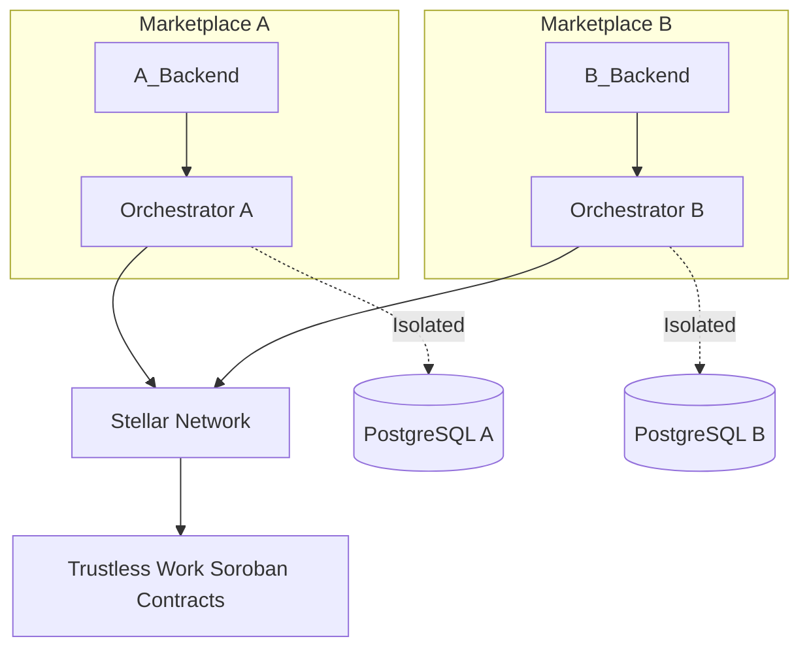

```
---
title: Architecture
description: Self-hosted, per-marketplace, non-custodial architecture overview.
order: 2
section: Guides
---

OFFER-HUB is **not a shared SaaS**. Every marketplace runs its own isolated Orchestrator instance.

<Callout type="danger">
  **Non-Negotiable Technical Principles**
</Callout>

- **Self-host required**
- **Per-user funds**
- **Non-custodial escrow**
- **Required idempotency/correlation**
- **Server-side secrets only**

## System Overview



## Next Steps

- [Quick Start](/docs/guide/quick-start)
- [Orchestrator Guide](/docs/guide/orchestrator)
- [Self-Hosting Guide](/docs/guide/self-hosting)
```

Changes: list moved OUTSIDE Callout, mermaid closing fixed to triple backticks.
