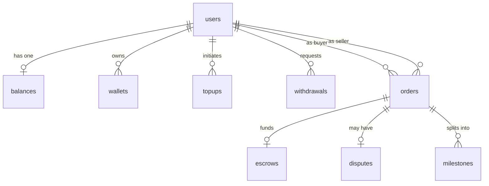

OFFER-HUB persists all state in a PostgreSQL database driven by Prisma. This page is the reference for the exact schema that a self-hosting participant hits directly when running migrations, inspecting seed data, or debugging. Every model, field, and relationship below is verified against the canonical `packages/database/prisma/schema.prisma` in the [OFFER-HUB Orchestrator](https://github.com/OFFER-HUB/OFFER-HUB) repository.

<Callout type="tip">
  Use this page together with the [Self-Hosting](/docs/guide/self-hosting) guide, which shows you how to configure `DATABASE_URL`, run `prisma migrate deploy`, and inspect the database in production.
</Callout>

<Callout type="danger">
  Two tables carry **critical invariants**: `balances.available` / `balances.reserved` and `wallets.secret_encrypted`. Never update balance values or decrypt wallet secrets directly in SQL — always go through the API's `BalanceService` and `WalletService`. Downstream financial bugs and unrecoverable funds are the cost of bypassing them.
</Callout>

## Entity–Relationship Overview

The following ER diagram shows every table and how they reference each other. Currency amounts are stored as **decimal strings** (`"100.00"`), not floats, to preserve exact precision in financial arithmetic.



## Model Reference

Each section lists the model's table name, the purpose it serves, and its key fields. Columns are rendered exactly as they appear in the Prisma schema, with the camelCase field name, its database column, type, and a short description.

### User

<Badge variant="primary">users</Badge>

A marketplace participant (buyer, seller, or both). `User` is the root of the identity graph — balances, wallets, top-ups, withdrawals, and orders all hang off it.

| Field | Column | Type | Description |
|-------|--------|------|-------------|
| `id` | `id` | String | Prefixed ID: `usr_` |
| `externalUserId` | `external_user_id` | String (unique) | The marketplace's own ID for this user |
| `email` | `email` | String? | Optional contact email |
| `type` | `type` | `UserType` | `BUYER` \| `SELLER` \| `BOTH` |
| `status` | `status` | `UserStatus` | `ACTIVE` \| `SUSPENDED` \| `PENDING_VERIFICATION` |
| `airtmUserId` | `airtm_user_id` | String? | Linked Airtm account (Airtm mode) |
| `airtmLinkedAt` | `airtm_linked_at` | DateTime? | When the Airtm link was established |
| `createdAt` / `updatedAt` | `created_at` / `updated_at` | DateTime | Timestamps |

### Balance

<Badge variant="primary">balances</Badge>

One row per user tracking spendable and reserved funds. `available` is immediately usable; `reserved` is held against an active order and is no longer spendable.

| Field | Column | Type | Description |
|-------|--------|------|-------------|
| `id` | `id` | String | CUID ID |
| `userId` | `user_id` | String (unique) | Owner user |
| `available` | `available` | String | Decimal string, default `"0.00"` |
| `reserved` | `reserved` | String | Decimal string, default `"0.00"` |
| `currency` | `currency` | String | Default `"USD"` |
| `updatedAt` | `updated_at` | DateTime | Last mutation |

**Invariant:** `available` and `reserved` must only change through `BalanceService` (credit/debit/reserve/release), which enforces atomicity, minimum-balance checks, event emission, and audit logging.

### ApiKey

<Badge variant="primary">api_keys</Badge>

Scoped credentials used to authenticate API calls via the `Authorization: Bearer ohk_...` header. Only the salted hash is stored — the raw key is shown once at creation.

| Field | Column | Type | Description |
|-------|--------|------|-------------|
| `id` | `id` | String | Prefixed ID: `key_` |
| `name` | `name` | String | Human-readable label |
| `hashedKey` | `hashed_key` | String (unique) | Salted hash of the key (not the raw key) |
| `salt` | `salt` | String | Per-key salt |
| `scopes` | `scopes` | String[] | e.g. `["read", "write"]` |
| `marketplaceId` | `marketplace_id` | String? | Isolation boundary (currently optional) |
| `lastUsedAt` | `last_used_at` | DateTime? | Last authenticated request |

### Wallet

<Badge variant="primary">wallets</Badge>

Invisible Stellar wallet whose secret keypair is encrypted at rest with AES-256-GCM using `WALLET_ENCRYPTION_KEY`. Each user has one primary wallet.

| Field | Column | Type | Description |
|-------|--------|------|-------------|
| `id` | `id` | String | Prefixed ID: `wal_` |
| `userId` | `user_id` | String | Owner user |
| `type` | `type` | `WalletType` | `INVISIBLE` (server keypair) \| `EXTERNAL` (future) |
| `provider` | `provider` | `WalletProvider` | `STELLAR` |
| `publicKey` | `public_key` | String (unique) | Stellar public key (also the deposit address) |
| `secretEncrypted` | `secret_encrypted` | String? | AES-256-GCM ciphertext (null for `EXTERNAL`) |
| `isPrimary` | `is_primary` | Boolean | Whether this is the primary wallet |
| `isActive` | `is_active` | Boolean | Whether the wallet is active |
| `lastSyncAt` | `last_sync_at` | DateTime? | Last on-chain sync |

### TopUp

<Badge variant="primary">topups</Badge>

Fiat on-ramp record (Airtm mode). Async flow driven by Airtm webhooks — see [Deposits Guide](/docs/guide/deposits).

| Field | Column | Type | Description |
|-------|--------|------|-------------|
| `id` | `id` | String | Prefixed ID: `topup_` |
| `userId` | `user_id` | String | Beneficiary user |
| `amount` | `amount` | String | Decimal string |
| `currency` | `currency` | String | Default `"USD"` |
| `status` | `status` | `TopUpStatus` | `TOPUP_CREATED` → `TOPUP_SUCCEEDED` etc. |
| `confirmationUri` | `confirmation_uri` | String? | Airtm hosted confirmation URL |
| `airtmPayinId` | `airtm_payin_id` | String? | Airtm payin reference |
| `metadata` | `metadata` | Json? | Free-form metadata |

### Order

<Badge variant="primary">orders</Badge>

The lifecycle root of a marketplace transaction. Funds move from the buyer's `available` balance into `reserved`, then on-chain via an escrow.

| Field | Column | Type | Description |
|-------|--------|------|-------------|
| `id` | `id` | String | Prefixed ID: `ord_` |
| `clientOrderRef` | `client_order_ref` | String (unique) | Marketplace's own order ID |
| `buyerId` | `buyer_id` | String | Buyer user |
| `sellerId` | `seller_id` | String | Seller user |
| `amount` | `amount` | String | Decimal string |
| `currency` | `currency` | String | Default `"USD"` |
| `status` | `status` | `OrderStatus` | `ORDER_CREATED` → `CLOSED` |
| `title` | `title` | String | Order title |
| `description` | `description` | String? | Order description |
| `metadata` | `metadata` | Json? | Free-form metadata |
| `escrow` / `dispute` / `milestones` | — | Relations | See ER diagram |

### Escrow

<Badge variant="primary">escrows</Badge>

Links an order to its non-custodial Trustless Work/Soroban contract on Stellar. Exactly one escrow per order.

| Field | Column | Type | Description |
|-------|--------|------|-------------|
| `id` | `id` | String | Prefixed ID: `esc_` |
| `orderId` | `order_id` | String (unique) | Parent order |
| `trustlessContractId` | `trustless_contract_id` | String (unique) | Trustless Work contract reference |
| `status` | `status` | `EscrowStatus` | `CREATING` → `RELEASED` / `REFUNDED` / `DISPUTED` |
| `amount` | `amount` | String | USDC amount (2 decimals) |
| `terms` | `terms` | Json? | e.g. `{ "milestones_required": true }` |
| `fundedAt` / `releasedAt` / `refundedAt` | `funded_at` / `released_at` / `refunded_at` | DateTime? | Timestamps |

### Milestone

<Badge variant="primary">milestones</Badge>

Optional sub-deliverables of an order, used when escrow terms require milestones.

| Field | Column | Type | Description |
|-------|--------|------|-------------|
| `id` | `id` | String | CUID ID |
| `orderId` | `order_id` | String | Parent order |
| `milestoneRef` | `milestone_ref` | String | Marketplace milestone reference |
| `title` | `title` | String | Title |
| `amount` | `amount` | String | Decimal string |
| `status` | `status` | `MilestoneStatus` | `OPEN` \| `COMPLETED` |

### Withdrawal

<Badge variant="primary">withdrawals</Badge>

Outbound funds transfer — either an Airtm payout or a direct Stellar payment. See [Withdrawals Guide](/docs/guide/withdrawals).

| Field | Column | Type | Description |
|-------|--------|------|-------------|
| `id` | `id` | String | Prefixed ID: `wd_` |
| `userId` | `user_id` | String | Owner user |
| `amount` | `amount` | String | Decimal string |
| `currency` | `currency` | String | Default `"USD"` |
| `status` | `status` | `WithdrawalStatus` | `WITHDRAWAL_CREATED` → `WITHDRAWAL_COMPLETED` etc. |
| `destinationType` | `destination_type` | String | `bank` \| `crypto` |
| `destinationRef` | `destination_ref` | String | Airtm email or Stellar address |
| `airtmPayoutId` | `airtm_payout_id` | String? | Airtm payout reference |

### Dispute

<Badge variant="primary">disputes</Badge>

A dispute opened on an order which freezes its lifecycle until resolved. Resolution produces a `ResolutionDecision`.

| Field | Column | Type | Description |
|-------|--------|------|-------------|
| `id` | `id` | String | Prefixed ID: `dsp_` |
| `orderId` | `order_id` | String (unique) | Disputed order |
| `openedBy` | `opened_by` | `DisputeOpenedBy` | `BUYER` \| `SELLER` |
| `reason` | `reason` | `DisputeReason` | `NOT_DELIVERED` \| `QUALITY_ISSUE` \| `OTHER` |
| `evidence` | `evidence` | Json? | Array of evidence URLs |
| `status` | `status` | `DisputeStatus` | `OPEN` \| `UNDER_REVIEW` \| `RESOLVED` |
| `resolutionDecision` | `resolution_decision` | `ResolutionDecision`? | `FULL_RELEASE` \| `FULL_REFUND` \| `SPLIT` |
| `decisionNote` | `decision_note` | String? | Note left with the decision |

### AuditLog

<Badge variant="primary">audit_logs</Badge>

Immutable, append-only record of state-changing actions for traceability and compliance.

| Field | Column | Type | Description |
|-------|--------|------|-------------|
| `id` | `id` | String | Prefixed ID: `aud_` |
| `occurredAt` | `occurred_at` | DateTime | When the action happened |
| `marketplaceId` | `marketplace_id` | String | Marketplace scope |
| `userId` | `user_id` | String? | Acting user |
| `action` | `action` | String | e.g. `order.create`, `balance.credit` |
| `resourceType` / `resourceId` | `resource_type` / `resource_id` | String / String | The affected resource |
| `payloadBefore` / `payloadAfter` | `payload_before` / `payload_after` | Json? / Json? | Pre/post state (secrets redacted) |
| `actorType` / `actorId` | `actor_type` / `actor_id` | String? / String? | Actor details |
| `result` / `error` | `result` / `error` | String? / Json? | Outcome |
| `idempotencyKey` / `correlationId` | `idempotency_key` / `correlation_id` | String? / String? | Correlation |
| `ip` / `userAgent` | `ip` / `user_agent` | String? / String? | Request context |

### WebhookEvent

<Badge variant="primary">webhook_events</Badge>

Deduplicates inbound webhooks from external providers (Airtm, Trustless Work, Stellar) via a unique `(provider, providerEventId)` constraint.

| Field | Column | Type | Description |
|-------|--------|------|-------------|
| `id` | `id` | String | CUID ID |
| `provider` | `provider` | `Provider` | `AIRTM` \| `TRUSTLESS_WORK` \| `STELLAR` |
| `providerEventId` | `provider_event_id` | String | Provider-side event ID |
| `status` | `status` | `WebhookStatus` | `RECEIVED` → `PROCESSED` / `FAILED` / `IGNORED` |
| `processedAt` | `processed_at` | DateTime? | When processed |
| `payload` | `payload` | Json? | Raw webhook body |

### IdempotencyKey

<Badge variant="primary">idempotency_keys</Badge>

Stores cached responses so retried requests return the same result instead of executing twice. Scoped per marketplace via `marketplaceId`.

| Field | Column | Type | Description |
|-------|--------|------|-------------|
| `id` | `id` | String | UUID |
| `key` | `key` | String | Client-supplied key |
| `marketplaceId` | `marketplace_id` | String | Marketplace scope |
| `requestHash` | `request_hash` | String | Hash of the request body |
| `status` | `status` | `IdempotencyStatus` | `PROCESSING` \| `COMPLETED` \| `FAILED` |
| `responseStatus` | `response_status` | Int? | Cached HTTP status |
| `responseBody` | `response_body` | Json? | Cached response body |
| `expiresAt` | `expires_at` | DateTime | Key TTL (24 hours) |

### ProcessedTransaction

<Badge variant="primary">processed_transactions</Badge>

DB-level deduplication safety net for on-chain Stellar deposits. Prevents double-crediting a balance when both the real-time monitor and the reconciliation worker observe the same payment.

| Field | Column | Type | Description |
|-------|--------|------|-------------|
| `id` | `id` | String | CUID ID |
| `transactionHash` | `transaction_hash` | String (unique) | Stellar transaction hash |
| `userId` | `user_id` | String | Credited user |
| `amount` | `amount` | String | Decimal string |
| `source` | `source` | String | `stellar_deposit` \| `stellar_deposit_reconciled` |
| `processedAt` | `processed_at` | DateTime | When the credit was applied |

## Enums

The schema defines these enums. Request bodies and webhook payloads use `UPPER_SNAKE_CASE` values.

| Enum | Values |
|------|--------|
| `UserType` | `BUYER`, `SELLER`, `BOTH` |
| `UserStatus` | `ACTIVE`, `SUSPENDED`, `PENDING_VERIFICATION` |
| `TopUpStatus` | `TOPUP_CREATED`, `TOPUP_AWAITING_USER_CONFIRMATION`, `TOPUP_PROCESSING`, `TOPUP_SUCCEEDED`, `TOPUP_FAILED`, `TOPUP_CANCELED` |
| `OrderStatus` | `ORDER_CREATED`, `FUNDS_RESERVED`, `ESCROW_CREATING`, `ESCROW_FUNDING`, `ESCROW_FUNDED`, `IN_PROGRESS`, `RELEASE_REQUESTED`, `RELEASED`, `REFUND_REQUESTED`, `REFUNDED`, `DISPUTED`, `CLOSED` |
| `WithdrawalStatus` | `WITHDRAWAL_CREATED`, `WITHDRAWAL_COMMITTED`, `WITHDRAWAL_PENDING`, `WITHDRAWAL_PENDING_USER_ACTION`, `WITHDRAWAL_COMPLETED`, `WITHDRAWAL_FAILED`, `WITHDRAWAL_CANCELED` |
| `EscrowStatus` | `CREATING`, `CREATED`, `FUNDING`, `FUNDED`, `RELEASING`, `RELEASED`, `REFUNDING`, `REFUNDED`, `DISPUTED` |
| `MilestoneStatus` | `OPEN`, `COMPLETED` |
| `DisputeStatus` | `OPEN`, `UNDER_REVIEW`, `RESOLVED` |
| `ResolutionDecision` | `FULL_RELEASE`, `FULL_REFUND`, `SPLIT` |
| `DisputeReason` | `NOT_DELIVERED`, `QUALITY_ISSUE`, `OTHER` |
| `DisputeOpenedBy` | `BUYER`, `SELLER` |
| `Provider` | `AIRTM`, `TRUSTLESS_WORK`, `STELLAR` |
| `WalletType` | `INVISIBLE`, `EXTERNAL` |
| `WalletProvider` | `STELLAR` |
| `WebhookStatus` | `RECEIVED`, `PROCESSED`, `FAILED`, `IGNORED` |
| `IdempotencyStatus` | `PROCESSING`, `COMPLETED`, `FAILED` |

## Migrations, Seeds, and Debugging

For self-hosters, the schema lives in `packages/database/prisma/schema.prisma`. Common operations:

### Apply pending migrations

<CommandLine>npx prisma migrate deploy --schema packages/database/prisma/schema.prisma</CommandLine>

### Inspect applied migrations

<CommandLine>npx prisma migrate status --schema packages/database/prisma/schema.prisma</CommandLine>

<Callout type="warning">
  Always take a database backup before running migrations in production. See the [Self-Hosting](/docs/guide/self-hosting) guide for the full workflow.
</Callout>

### Inspect data

Use the Prisma Studio GUI or standard SQL. For example, find a user's current balance:

```sql
SELECT u.id, u.type, b.available, b.reserved
FROM users u
LEFT JOIN balances b ON b.user_id = u.id
WHERE u.id = 'usr_...';
```

## Related Guides

- [Orchestrator](/docs/guide/orchestrator) — how the models drive the payment engine
- [Orders Guide](/docs/guide/orders) — the order lifecycle across `Order`, `Escrow`, and `Milestone`
- [Wallets Guide](/docs/guide/wallets) — wallet encryption and Stellar keypairs
- [Deposits Guide](/docs/guide/deposits) — `TopUp` and `ProcessedTransaction` flows
- [Withdrawals Guide](/docs/guide/withdrawals) — `Withdrawal` flows
- [Security Best Practices](/docs/guide/security) — protecting balances, wallets, and API keys