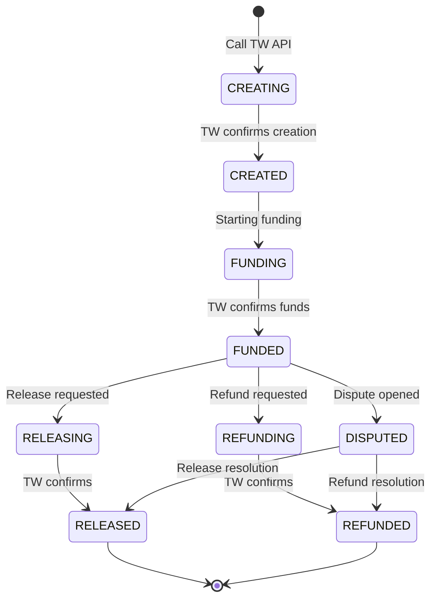
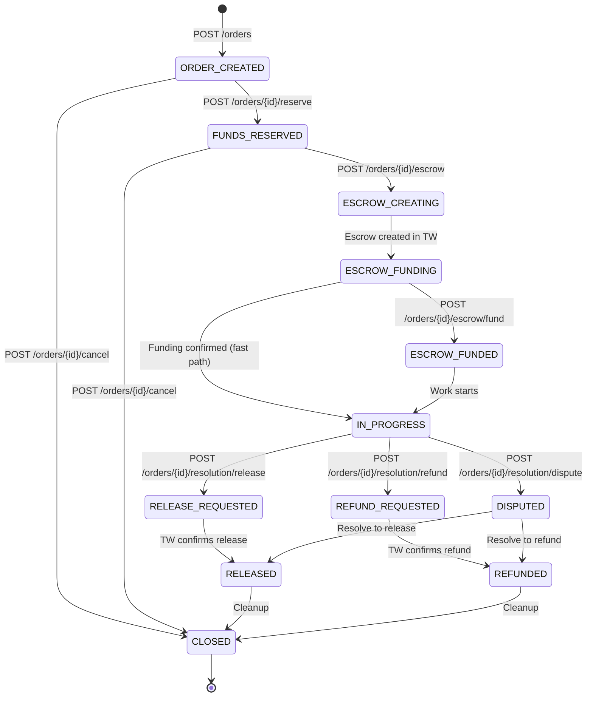
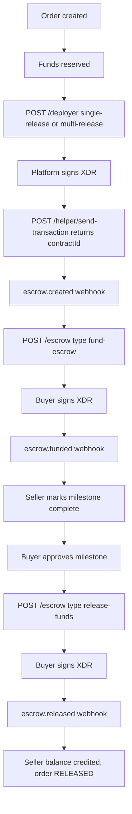

<Callout type="note">
  This is the public API guide for the Trustless Work escrow provider. Every endpoint, field, status, and environment variable below is verified against the Orchestrator implementation in the [OFFER-HUB repository](https://github.com/OFFER-HUB/OFFER-HUB) — chiefly `apps/api/src/providers/trustless-work` (`trustless-work.config.ts`, `clients/escrow.client.ts`, `clients/wallet.client.ts`, `services/webhook.service.ts`, `services/balance-projection.service.ts`, `types/trustless-work.types.ts`, `dto/escrow.dto.ts`, `dto/webhook.dto.ts`), `apps/api/src/modules/webhooks/webhooks.controller.ts`, and the shared enums in `packages/shared/src/enums`.
</Callout>

Trustless Work is the escrow provider behind every OFFER-HUB checkout. It is a managed API in front of Soroban smart contracts on Stellar: the Orchestrator asks it to build and operate an escrow contract, and the actual custody is a contract on-chain, not a row in the Orchestrator's database.

That split drives everything on this page. The Orchestrator owns the *ledger* (orders, balances, state machines). Trustless Work owns the *contract*. Every operation crosses that boundary twice — once to get an unsigned transaction, once to submit the signed result — and every state change has to come back as a signed webhook before the Orchestrator will act on it.

| Concern | Owner | Where it lives |
|---------|-------|----------------|
| Order and escrow state machines | Orchestrator | `packages/shared/src/enums/escrow-status.enum.ts`, `packages/shared/src/enums/order-status.enum.ts` |
| Escrow contract and funds | Trustless Work | Soroban contract on Stellar, addressed by `contractId` |
| Provider API call | Orchestrator → Trustless Work | `EscrowClient` |
| Contract event notification | Trustless Work → Orchestrator | `POST /api/v1/webhooks/trustless-work` |
| Ledger balance projection | Orchestrator | `BalanceProjectionService` |

## Enabling Trustless Work

`TrustlessWorkModule` (`apps/api/src/providers/trustless-work/trustless-work.module.ts`) is registered with the API and provides `TrustlessWorkConfig`, `EscrowClient`, `WalletClient`, `WebhookService` and `BalanceProjectionService`. There is no feature flag to flip: escrow is always on, and the provider starts returning real data as soon as its configuration validates.

The consequences of "always on" are worth knowing before you touch configuration:

- `TrustlessWorkConfig` validates in its constructor and calls `getRequiredEnv()` for `TRUSTLESS_API_KEY`, `TRUSTLESS_WEBHOOK_SECRET` and `PLATFORM_USER_ID`. If any of the three is missing the process throws `Missing required environment variable: <NAME>` and the API does not boot.
- `PLATFORM_USER_ID` must resolve to a real user with an active Stellar wallet. `BootstrapValidatorService` (`apps/api/src/modules/config/bootstrap-validator.service.ts`) also checks it, and `npm run bootstrap` is what writes it.
- `PAYMENT_PROVIDER` must stay `crypto`. Trustless Work is the escrow rail behind that strategy, not a value you select there.
- `WALLET_ENCRYPTION_KEY` is not read at startup. It is the 32-byte AES-256-GCM key that encrypts the invisible-wallet Stellar keypairs (`apps/api/src/utils/crypto.ts`), and it throws on first wallet use rather than at boot — a failure you will see on the first escrow, not on deploy.

## Prerequisites

1. **A Trustless Work account** — API keys come from [dapp.trustlesswork.com](https://dapp.trustlesswork.com). The key format is `{id}.{secret}`; the config logs a warning when the shape does not match.
2. **A webhook secret** — a `tw_whsec_...` value shared with Trustless Work. The config warns when the value does not start with `tw_whsec_`.
3. **A bootstrapped platform user** — `PLATFORM_USER_ID` pointing at an internal user with an active Stellar wallet, created by `npm run bootstrap`. This user is the `platformAddress` and the `disputeResolver` on every contract.
4. **Stellar network configuration** — `STELLAR_NETWORK` plus the matching Horizon URL and USDC issuer, because the Orchestrator verifies contract transactions against Horizon before trusting a webhook.
5. **A USDC trustline on every address in `roles`** — the buyer, the seller, and the platform wallet. A missing trustline fails at the contract, not at the Orchestrator.

## Configuration

### Environment variables

| Variable | Required | Default | Effect |
|----------|----------|---------|--------|
| `TRUSTLESS_API_KEY` | **Yes** | none | Sent as the `x-api-key` header on every provider request. Throws at startup if absent. |
| `TRUSTLESS_WEBHOOK_SECRET` | **Yes** | none | HMAC-SHA256 key for inbound webhook verification. Throws at startup if absent. |
| `PLATFORM_USER_ID` | **Yes** | none | Internal user ID whose Stellar wallet becomes `platformAddress` and `disputeResolver`. Throws at startup if absent. |
| `TRUSTLESS_API_URL` | No | `https://api.trustlesswork.com/v1` | Base URL for provider calls. |
| `TRUSTLESS_TIMEOUT_MS` | No | `60000` | Per-request timeout. Must be between `1000` and `120000`. |
| `STELLAR_NETWORK` | No | `testnet` | Must be exactly `testnet` or `mainnet`; anything else throws. |
| `STELLAR_HORIZON_URL` | No | testnet/mainnet Horizon | Must start with `https://`. Used for balance lookups and transaction verification. |
| `STELLAR_USDC_ASSET_CODE` | No | `USDC` | Asset code matched when reading wallet balances. |
| `STELLAR_USDC_ISSUER` | No | testnet USDC issuer | Must be a 56-character Stellar public key starting with `G`. Also sent to the provider as the contract `trustline.address`. |
| `PAYMENT_PROVIDER` | No | `crypto` | Stays `crypto`; escrow runs on the crypto-native path. |
| `WALLET_ENCRYPTION_KEY` | **Yes** | none | 64 hex characters (32 bytes) for AES-256-GCM wallet key encryption. Not validated at startup. |

Source for every row: `apps/api/src/providers/trustless-work/trustless-work.config.ts`.

### What throws and what only warns

Startup validation is not uniform, and the difference matters when you are reading logs.

| Rule | Severity |
|------|----------|
| `TRUSTLESS_API_KEY`, `TRUSTLESS_WEBHOOK_SECRET`, `PLATFORM_USER_ID` present | **Throws** — the API does not start |
| `TRUSTLESS_API_KEY` matches `{id}.{secret}` | Warns |
| `TRUSTLESS_WEBHOOK_SECRET` starts with `tw_whsec_` | Warns |
| `TRUSTLESS_TIMEOUT_MS` within `1000`–`120000` | **Throws** |
| `STELLAR_NETWORK` is `testnet` or `mainnet` | **Throws** |
| `STELLAR_HORIZON_URL` starts with `https://` | **Throws** |
| `STELLAR_USDC_ISSUER` is a `G...` 56-character key | **Throws** |

<Callout type="warning">
  A warning means the process booted anyway. A key that silently fails the `{id}.{secret}` check, or a webhook secret that is not a real `tw_whsec_` value, will fail later at the provider rather than at boot — so treat startup warnings as defects, not noise.
</Callout>

### Testnet and mainnet

`TRUSTLESS_API_URL` and the Stellar network are set independently, and a mismatch is the most common cause of a provider call that authenticates but then behaves oddly.

| Target | `TRUSTLESS_API_URL` | `STELLAR_NETWORK` | `STELLAR_USDC_ISSUER` |
|--------|---------------------|-------------------|----------------------|
| Testnet | `https://dev.api.trustlesswork.com` | `testnet` | testnet issuer (default) |
| Mainnet | `https://api.trustlesswork.com` | `mainnet` | Circle's mainnet issuer — **set it explicitly** |

<Callout type="warning">
  The config default is `https://api.trustlesswork.com/v1`, but `HealthService` falls back to `https://dev.api.trustlesswork.com` when the variable is unset. Because the health probe appends `/health` to whatever it resolves, leaving `TRUSTLESS_API_URL` unset probes the dev host even in a mainnet deployment, and setting it to the default probes `.../v1/health`. Set the variable explicitly and make sure your provider base URL and health base URL agree.
</Callout>

## Verifying a deployment

Two public endpoints tell you whether the provider is wired correctly. Both are safe to poll.

**`GET /api/v1/config`** (`apps/api/src/modules/config/config.controller.ts`) reports:

- `features.trustlessWork` — `true` only when `TRUSTLESS_API_KEY` is set
- `providers.escrow` — reported as `trustless_work`

**`GET /api/v1/health`** (`apps/api/src/modules/health/health.service.ts`) reports `dependencies.trustlessWork`:

- `degraded` with `Not configured` — `TRUSTLESS_API_KEY` is absent
- `healthy` — the provider's `/health` responded, or answered with any status below `500`
- `degraded` — the provider is unreachable, or answered `5xx`, within a `5000` ms probe

### Configuration and verification checklist

- [ ] `GET /api/v1/config` returns `features.trustlessWork: true` and `providers.escrow: "trustless_work"`
- [ ] `GET /api/v1/health` reports `dependencies.trustlessWork.status: "healthy"`
- [ ] No `Missing required environment variable` line in the startup log
- [ ] No `TRUSTLESS_API_KEY format may be invalid` or `tw_whsec_` warning in the startup log
- [ ] `TRUSTLESS_API_URL` matches `STELLAR_NETWORK` (testnet pairs with `dev.api`, mainnet with `api.`)
- [ ] `STELLAR_USDC_ISSUER` is explicitly set for mainnet, not left on the testnet default
- [ ] `PLATFORM_USER_ID` resolves to a user with an active Stellar wallet
- [ ] Platform wallet, buyer wallet, and seller wallet all hold a USDC trustline for the configured issuer
- [ ] `WALLET_ENCRYPTION_KEY` is 64 hex characters and stored outside the repository
- [ ] A full lifecycle (deploy → fund → milestone → approve → release) has been run on testnet
- [ ] `POST /api/v1/webhooks/trustless-work` is registered with the provider and reachable from the internet

## Contract ownership and signer roles

`EscrowClient.createEscrow()` builds the contract payload sent to the provider, and that payload is the whole ownership model in one object. The Orchestrator maps the order's two parties and the platform identity onto six fixed roles:

| Trustless Work role | Value sent | Meaning |
|---------------------|------------|---------|
| `signer` | platform wallet | Signs the deployment transaction |
| `approver` | buyer | Confirms a milestone is done |
| `serviceProvider` | seller | Marks a milestone complete |
| `platformAddress` | platform wallet | Receives the platform fee; must hold a USDC trustline |
| `releaseSigner` | buyer | Authorises release of funds |
| `disputeResolver` | platform wallet | Settles disputes; must differ from the disputer |
| `receiver` | seller | Final recipient of the funds |

The remaining fields follow the same rules:

- `engagementId` is your `order_id`, which is what ties a provider contract back to an Orchestrator order.
- `amount` is a USDC number, and `platformFee` is a **percentage that must be greater than zero** — a fixed amount is rejected by the provider.
- `trustline` carries `STELLAR_USDC_ISSUER` and the symbol `USDC`.
- The endpoint depends on the shape of the deal: one milestone goes to `/deployer/single-release`, more than one goes to `/deployer/multi-release` (`EscrowClient.createEscrow()` switches on `milestones.length > 1`).
- Milestone amounts are validated before the call: they must sum exactly to the total, compared with `big.js`. A mismatch fails locally, without spending a provider request.

<Callout type="note">
  The `disputeResolver` must be a different party from whoever opens the dispute, and the contract enforces it. That is what stops either side from unilaterally taking the funds: the buyer can release to the seller, the seller cannot release to itself, and only the platform can settle — so a dispute is a real decision point rather than a unilateral withdrawal.
</Callout>

## Amounts and units

Getting units wrong is the single most common integration bug, so the three representations are worth keeping straight:

| Context | Format | Example |
|---------|--------|---------|
| Orchestrator API and database | Decimal string, exactly 2 places | `"100.00"` (enforced by `@Matches(/^\d+\.\d{2}$/)` in `dto/escrow.dto.ts`) |
| Trustless Work API | Number in **USDC** | `100` |
| Stellar on-chain | Integer in stroops | `100000000` |

`CreateEscrowDto` and `MilestoneDto` both reject anything that is not a 2-decimal string, so the conversion to a USDC number happens once, inside `EscrowClient`, with `parseFloat`. On the way back, `WalletClient` converts Horizon's decimal balances to stroops and `BalanceProjectionService` converts back to the 2-decimal format for display.

<Callout type="warning">
  Never send stroops to the provider. The provider takes USDC and converts internally; sending `100000000` for a `100.00` order fails with an amount mismatch, usually reported as *"The escrow balance must be equal to the amount of earnings"*.
</Callout>

## The unsigned-XDR handshake

Every write operation against the provider follows the same three steps, and the second one is what makes the integration non-custodial from the user's point of view — no browser wallet is ever involved.

1. **Request** — call the provider. It returns an `unsignedTransaction` (XDR) and nothing else; no state has changed.
2. **Sign** — the Orchestrator signs the XDR server-side with the invisible Stellar wallet of the party that owns that step.
3. **Submit** — `POST /helper/send-transaction` with `{ signedXdr }` returns `{ status, contractId }` and, for a deployment, the full escrow object.

Who signs which step is fixed by the contract roles, and mixing them up is a provider error rather than a subtle bug:

| Step | Provider endpoint | Signer | Role |
|------|-------------------|--------|------|
| Deploy | `/deployer/single-release`, `/deployer/multi-release` | Platform | `signer` |
| Fund | `/escrow/{type}/fund-escrow` | Buyer | `signer` |
| Mark milestone complete | `/escrow/{type}/change-milestone-status` | Seller | `serviceProvider` |
| Approve milestone | `/escrow/{type}/approve-milestone` | Buyer | `approver` |
| Release funds | `/escrow/{type}/release-funds` | Buyer | `releaseSigner` |
| Open dispute | `/escrow/{type}/dispute-escrow` | Disputing party | `signer` |
| Resolve dispute | `/escrow/{type}/resolve-dispute` | Platform | `disputeResolver` |
| Submit signed XDR | `/helper/send-transaction` | — | — |

In the table, `{type}` is `single-release` or `multi-release`, and must match how the contract was deployed.

<Callout type="tip">
  A release is three provider calls in sequence, not one: mark the milestone complete (seller signs), approve it (buyer signs), then release (buyer signs). Skipping the first two produces the provider's *"The escrow must be completed to release earnings"* rejection. The sequence is spelled out end to end in `ResolutionService.requestRelease()` and reproduced in the module's own `README.md`.
</Callout>

## Refunds and disputes

A refund is not a separate provider operation in the current client — it is the two-step dispute path, which is also what makes a refund auditable.

1. `disputeEscrow(contractId, signerAddress)` opens the dispute and returns an unsigned XDR that the disputing party signs.
2. `resolveDisputeForRefund()` or `resolveDisputeWithSplit()` settles it, sending `disputeResolver` plus a `distributions` array of `{ address, amount }` in USDC. A full refund is a single distribution of the whole amount to the buyer; a split sends the platform fee, the buyer's share, and the seller's share separately.

Both return an unsigned XDR that the platform signs as `disputeResolver` before submission.

## Escrow lifecycle and state mapping

The provider has its own vocabulary; the Orchestrator has two state machines that must follow it. `mapTrustlessStatus()` (`types/trustless-work.types.ts`) maps the nine provider statuses onto the nine internal `EscrowStatus` values, and the webhook handlers then drive the order.





### Provider event to internal state

Each row is one branch of the `switch` in `WebhookService.processWebhook()`:

| Provider event | `EscrowStatus` written | `OrderStatus` written | Side effects |
|----------------|-----------------------|---------------------|--------------|
| `escrow.created` | from `data.status` | `ESCROW_FUNDING` | Stores `trustlessContractId` on the escrow; writes an `ESCROW_CREATED` audit log |
| `escrow.funding_started` | from `data.status` | — | Status update only |
| `escrow.funded` | from `data.status`, sets `fundedAt` | `IN_PROGRESS` | Writes an `ESCROW_FUNDED` audit log |
| `escrow.milestone_completed` | — | — | Logged; milestones are tracked separately in the database |
| `escrow.released` | `RELEASED`, sets `releasedAt` | via `confirmRelease(orderId)` | Credits the seller |
| `escrow.refunded` | `REFUNDED`, sets `refundedAt` | via `confirmRefund(orderId)` | Credits the buyer |
| `escrow.disputed` | `DISPUTED` | — | Status update only |

Two details in that table are easy to miss:

- `escrow.created` looks the escrow up **through its order** (`order: { id: order_id }`) because the contract ID is being recorded for the first time. Every later event looks it up by `trustlessContractId`.
- `escrow.funded` moves the order straight to `IN_PROGRESS`. The order machine allows `ESCROW_FUNDING → ESCROW_FUNDED` as well, so a deployment that only receives the funded event never passes through `ESCROW_FUNDED` on the order.

An unknown `type` is logged and ignored rather than rejected — the event is still stored, so it shows up in the `WebhookEvent` table for inspection.

### The lifecycle end to end



If any step is disputed instead of released, `escrow.disputed` marks the escrow `DISPUTED`, and the resolution ends in either `escrow.released` or `escrow.refunded`.

### Balance projection

`BalanceProjectionService.projectUserBalance()` reports a user's total as three parts, and only the middle one is unusual:

```
total = airtm available + airtm reserved + on-chain escrow
```

The on-chain part is the sum of `amount` over escrows where the user is the **buyer** and the escrow is `FUNDED` — money the user has committed but that still belongs to them. `getOnChainBalance(address)` reads a raw Stellar USDC balance through `WalletClient` and converts it into the same 2-decimal format. The returned `ProjectedBalance` carries `available`, `reserved`, `on_chain`, `total`, `currency` and `last_updated`.

## Webhook signature verification

The receiver is `POST /api/v1/webhooks/trustless-work` in `WebhooksController`. It always answers `200` once the signature passes, and `401` with `WEBHOOK_SIGNATURE_INVALID` when it does not.

The header is **`x-tw-signature`**, a lowercase hex **HMAC-SHA256** digest of the **raw request body** keyed with `TRUSTLESS_WEBHOOK_SECRET`:

```
x-tw-signature = HMAC-SHA256(rawBody, TRUSTLESS_WEBHOOK_SECRET)
```

`WebhookService.verifySignature()` reads `req.rawBody` and compares with a plain string inequality — there is no timestamp window and no replay protection beyond event deduplication, which is why the raw body must reach the handler unmodified.

<Callout type="warning">
  A request that arrives **without** an `x-tw-signature` header is logged as a warning and processed anyway. That is a development affordance, not a security control. In production, set `TRUSTLESS_WEBHOOK_SECRET`, make sure the provider actually sends the header, and alert on the `Trustless Work webhook received without signature header` line in your logs.
</Callout>

The payload is validated by `TrustlessWebhookDto`:

```json
{
  "type": "escrow.funded",
  "event_id": "evt_trustless_123",
  "data": {
    "contract_id": "CTW4Q6N...",
    "order_id": "ord_abc123",
    "status": "FUNDED",
    "amount": "500000000",
    "currency": "USDC",
    "buyer_address": "GBCG42WTVWPO4Q6N...",
    "seller_address": "GBRTW2CXBA7ZQBCN...",
    "transaction_hash": "abcdef0123...",
    "milestone_ref": "M1",
    "created_at": "2026-02-20T12:00:00.000Z",
    "updated_at": "2026-02-20T12:05:00.000Z"
  }
}
```

`amount` is in **stroops** here, unlike the USDC numbers sent on the way out.

The full receiver reference — headers, payload shape, response bodies — is in [Inbound Webhooks](/docs/api-reference/webhooks).

## Timeouts, retries and failure behavior

### Timeouts

| Timeout | Value | Governs |
|---------|-------|---------|
| `TRUSTLESS_TIMEOUT_MS` | `60000` default, `1000`–`120000` | Every `EscrowClient` and `WalletClient` HTTP call, enforced with `AbortController` |
| Health probe | `5000` | `GET {TRUSTLESS_API_URL}/health` on `GET /api/v1/health` |

When the abort fires, `handleApiError()` converts the `AbortError` into `PROVIDER_TIMEOUT` with the message `Trustless Work API timeout`. A 60-second default is deliberate: deploying a Soroban contract is slower than a normal API call, and lowering it will turn slow-but-successful contract deployments into failures.

### Retries

Retries are applied in exactly one place: `EscrowClient.sendTransaction()`, which tries up to **3 attempts**.

- It retries **only** when the error body mentions `resultMetaXdr` or `not be complete yet` — the provider telling you the transaction has not finished being assembled.
- Backoff is linear: `attempt × 3000` ms, so 3 s then 6 s between the three attempts.
- Any other error is thrown immediately. Nothing else in the client retries, including deploy, fund, release, and dispute.

This is deliberate on the provider's side: a retried *write* risks a double execution, while a retried *submission* of an already-signed XDR is idempotent. If a deploy call fails, re-running it is your decision to make after checking the provider's contract state — the Orchestrator will not do it for you.

### Provider HTTP status to error code

`handleHttpError()` maps the provider's HTTP status onto stable error codes and attaches the parsed response body as `details`:

| Provider status | Error code | Message |
|----------------|-----------|---------|
| `404` | `ESCROW_NOT_FOUND` | `Escrow contract not found` |
| `409` | `ESCROW_ALREADY_FUNDED` | Provider's `message`, or `Escrow contract already funded` |
| `422` | `ESCROW_INSUFFICIENT_FUNDS` | Provider's `message`, or `Invalid escrow operation` |
| `503` | `PROVIDER_UNAVAILABLE` | `Trustless Work temporarily unavailable` |
| Abort | `PROVIDER_TIMEOUT` | `Trustless Work API timeout` |
| Anything else | `PROVIDER_ERROR` | `Trustless Work API error: <status>` |

<Callout type="warning">
  A `422` is the catch-all for *any* invalid operation, not only insufficient funds. Trustless Work's own validation messages — missing `serviceProvider`, `approver`, or `releaseSigner` — arrive as `ESCROW_INSUFFICIENT_FUNDS` with the real explanation in `details.message`. Always read `details` before concluding that a balance is the problem.
</Callout>

### Failure and retry behavior

What happens after a failure, in order:

1. **The provider call fails.** The client throws a coded error; the order stays in whatever state it was in, because the state transition only happens on a verified webhook.
2. **A webhook carrying a `transaction_hash` is verified before it is trusted.** `verifyTransactionIfPresent()` asks Horizon whether the transaction exists and succeeded. An unverified or unsuccessful hash throws **before** any database write.
3. **A failed handler leaves no trace of the event.** `storeWebhookEvent()` runs only after the handler returns, so a throwing handler means the `WebhookEvent` row is never written and the delivery is not marked as seen.
4. **The provider retries.** A thrown error propagates out of the controller as a `500`, which tells Trustless Work to redeliver — and because nothing was stored, that retry is processed normally.
5. **A successful handler stores the event** as `(TRUSTLESS_WORK, event_id)`, and any redelivery returns `200` with no state change applied.

| Symptom | Cause | What to do |
|---------|-------|------------|
| `404` / `ESCROW_NOT_FOUND` on a known contract | Wrong `TRUSTLESS_API_URL` for the network, or the contract was deployed on the other network | Confirm testnet and mainnet pairs; check the contract on the right explorer |
| `409` / `ESCROW_ALREADY_FUNDED` | Funding submitted twice, usually after a retry that already landed | Read the contract state before resubmitting — a second fund is not the fix |
| `422` with *"must be equal to the amount of earnings"* | Deploy and fund used different units or values | Send USDC on both, and keep the funded amount equal to the deployed amount |
| `422` with `serviceProvider required` / `approver required` / `releaseSigner required` | The role argument was omitted from the provider call | Pass the correct role address for the step — see [the signer table](#the-unsigned-xdr-handshake) |
| `422` with *"must be completed to release earnings"* | Release attempted before the milestone was completed and approved | Run change-milestone-status, then approve-milestone, then release |
| `PROVIDER_TIMEOUT` on a deploy | `TRUSTLESS_TIMEOUT_MS` too low for Soroban contract deployment | Raise it toward the 120000 ceiling rather than retrying blindly |
| `PROVIDER_UNAVAILABLE` (`503`) | Provider outage | Retry; the health endpoint will report the same failure as `degraded` |
| Webhook `500`, repeated deliveries | `transaction_hash` failed Horizon verification | Check the transaction on the explorer — the Orchestrator will not apply the state change while it is unsuccessful |
| `401` / `WEBHOOK_SIGNATURE_INVALID` | Secret mismatch, or the raw body was altered in transit | Re-issue the `tw_whsec_` secret, register it with the provider, and restart |
| State advanced but no webhook arrived | Provider cannot reach the callback URL | Confirm the endpoint is publicly reachable and that `event_id` deduplication is not hiding a redelivery |
| Milestone marked complete but nothing else changed | `escrow.milestone_completed` only logs | Expected — milestones live in the database, not in the escrow status column |

<Callout type="note">
  Every escrow failure in this list has the same recovery shape: the Orchestrator does not move state on an unverified event, so the fix is always to make the provider call or the webhook succeed and let the retry apply the transition. You never need to hand-patch an order out of a stuck escrow state.
</Callout>

## Non-custodial guarantees

- **Funds live in a Soroban contract.** The Orchestrator's `Escrow` row is a pointer — `trustlessContractId` — to a contract address on Stellar. There is exactly one escrow per order, and the balance behind it is on-chain.
- **The Orchestrator holds keys, not balances.** It stores encrypted invisible-wallet Stellar keypairs with `WALLET_ENCRYPTION_KEY`, and that key is the single thing worth protecting.
- **No browser wallet, ever.** Users never sign with Freighter or Albedo. The server signs each XDR with the invisible wallet of the party that owns that step, so custody never depends on a user keeping a seed phrase safe.
- **Release requires the buyer's authorisation.** `releaseSigner` is the buyer, so a seller cannot release to itself, and the funds can only leave the contract to `receiver` after that signature.
- **Disputes need a third party.** `disputeResolver` is the platform, and the contract requires it to differ from the disputing party — so neither side can settle a dispute in its own favour.
- **Every state change is evidence-backed.** On-chain events carry a `transaction_hash` that is verified against Horizon before the Orchestrator acts, and every handled event is recorded in the `WebhookEvent` table for audit.

## Production checklist

- [ ] `STELLAR_NETWORK=mainnet` with a matching `TRUSTLESS_API_URL`
- [ ] `STELLAR_USDC_ISSUER` set explicitly to Circle's mainnet issuer
- [ ] `TRUSTLESS_TIMEOUT_MS` sized for contract deployment, within `1000`–`120000`
- [ ] A complete lifecycle run end to end on testnet before switching networks
- [ ] USDC trustline confirmed on the platform wallet and on both parties' wallets
- [ ] `WALLET_ENCRYPTION_KEY` generated with `node -e "console.log(require('crypto').randomBytes(32).toString('hex'))"` and stored in a secret manager
- [ ] `TRUSTLESS_WEBHOOK_SECRET` registered with the provider and actually sent on delivery
- [ ] `GET /api/v1/health` polled for `dependencies.trustlessWork`, with alerting on `degraded`
- [ ] Rate limiting configured so provider write calls stay within your plan
- [ ] Startup-log warnings reviewed — none should remain

## Next steps

- [Escrow Guide](/docs/guide/escrow) — the escrow lifecycle from the integrator's point of view
- [Escrow Flows](/docs/guide/escrow-flows) — every flow, with the milestone and dispute sequences
- [Inbound Webhooks](/docs/api-reference/webhooks) — receiver reference, signature verification, deduplication
- [Events](/docs/api-reference/events) — the SSE catalog these transitions emit on
- [Configuration](/docs/configuration) — every Orchestrator environment variable in one table
- [Self-Hosting](/docs/guide/self-hosting) — deploying with the `TRUSTLESS_*` variables and exposing the webhook
- [Security Best Practices](/docs/guide/security) — key handling and webhook secret hygiene
