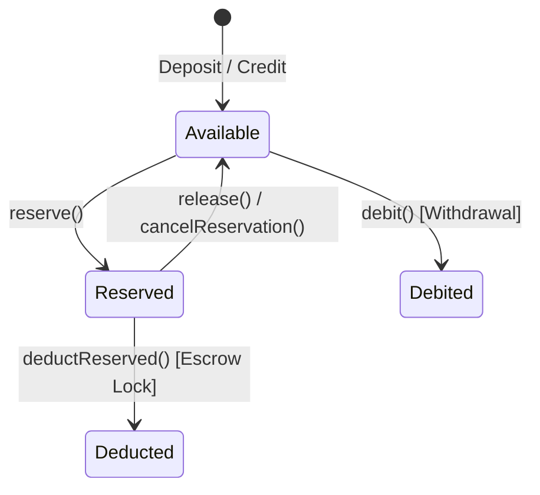

The `sdk.balance` resource provides methods to manage the dual ledger system of OFFER-HUB: fast off-chain balances (with `available` and `reserved` splits) synchronized with on-chain Stellar trustline or payment provider assets.

<Callout type="note">
  **Orchestrator Source References:**
  - Controller: `apps/api/src/modules/balance/balance.controller.ts`
  - DTOs:
    - `CreditBalanceDto` (`apps/api/src/modules/balance/dto/credit-balance.dto.ts`)
    - `DebitBalanceDto` (`apps/api/src/modules/balance/dto/debit-balance.dto.ts`)
    - `ReserveBalanceDto` (`apps/api/src/modules/balance/dto/reserve-balance.dto.ts`)
    - `ReleaseBalanceDto` (`apps/api/src/modules/balance/dto/release-balance.dto.ts`)
    - `CancelReservationDto` (`apps/api/src/modules/balance/dto/cancel-reservation.dto.ts`)
    - `DeductReservedDto` (`apps/api/src/modules/balance/dto/deduct-reserved.dto.ts`)
  - Service: `apps/api/src/modules/balance/balance.service.ts`
  - Database Models: `Balance`, `BalanceTransaction`, `Reservation` in `packages/db/prisma/schema.prisma`
</Callout>

---

## Balance Ledger Lifecycle



---

## Resource Overview

| Method | HTTP Route | Description |
|---|---|---|
| [`sdk.balance.get()`](#get) | `GET /api/v1/users/:userId/balance` | Retrieves current available and reserved balance |
| [`sdk.balance.credit()`](#credit) | `POST /api/v1/users/:userId/balance/credit` | Credits funds to available balance |
| [`sdk.balance.debit()`](#debit) | `POST /api/v1/users/:userId/balance/debit` | Debits funds from available balance |
| [`sdk.balance.reserve()`](#reserve) | `POST /api/v1/users/:userId/balance/reserve` | Moves funds from available to reserved |
| [`sdk.balance.release()`](#release) | `POST /api/v1/users/:userId/balance/release` | Moves funds from reserved back to available |
| [`sdk.balance.cancelReservation()`](#cancelreservation) | `POST /api/v1/users/:userId/balance/cancel-reservation` | Cancels all reservations for a specific order |
| [`sdk.balance.deductReserved()`](#deductreserved) | `POST /api/v1/users/:userId/balance/deduct-reserved` | Permanently consumes reserved funds for escrow |
| [`sdk.balance.sync()`](#sync) | `POST /api/v1/users/:userId/balance/sync` | Reconciles off-chain ledger with provider / Stellar chain |
| [`sdk.balance.verify()`](#verify) | `GET /api/v1/users/:userId/balance/verify` | Audits off-chain ledger against on-chain balance without mutating |

---

## Common Types

```typescript
interface Balance {
  userId: string;
  available: string; // Decimal string formatted, e.g. "100.00"
  reserved: string;  // Decimal string formatted, e.g. "25.00"
  total: string;     // Sum of available + reserved, e.g. "125.00"
  currency: string;  // Currency ISO code, e.g. "USD" or "USDC"
  updatedAt: string; // ISO-8601 timestamp
}
```

---

## Methods

### `get`

Retrieves the current available and reserved balance for a specific user.

#### Signature

```typescript
async get(userId: string): Promise<Balance>
```

#### Parameters

| Parameter | Type | Required | Description |
|---|---|---|---|
| `userId` | `string` | **Yes** | Target OFFER-HUB user ID (`usr_...`) |

#### Return Type

`Promise<Balance>`

#### Errors

| Error Class | HTTP Status | Code | Cause |
|---|---|---|---|
| `NotFoundError` | `404` | `USER_NOT_FOUND` | User does not exist |

#### Example

```typescript
import { OfferHubSDK } from '@offerhub/sdk';

const sdk = new OfferHubSDK({
  apiUrl: process.env.OFFERHUB_API_URL!,
  apiKey: process.env.OFFERHUB_API_KEY!,
});

const balance = await sdk.balance.get('usr_abc123');
console.log(`Available: ${balance.available} ${balance.currency}`);
console.log(`Reserved: ${balance.reserved} ${balance.currency}`);
```

---

### `credit`

Credits an amount directly to the user's `available` balance (used for manual top-ups, referral bonuses, or platform adjustments).

#### Signature

```typescript
async credit(userId: string, params: CreditBalanceParams): Promise<Balance>
```

#### Parameters

| Parameter | Type | Required | Description |
|---|---|---|---|
| `userId` | `string` | **Yes** | Target user ID |
| `params.amount` | `string` | **Yes** | Positive numeric string representing the amount to credit (e.g. `'50.00'`) |
| `params.currency` | `string` | No | Currency code (defaults to platform base currency) |
| `params.reference` | `string` | No | External reference ID (e.g. promotional ID or external transaction ID) |
| `params.description` | `string` | No | Human-readable audit log description |

#### Return Type

`Promise<Balance>`

#### Errors

| Error Class | HTTP Status | Code | Cause |
|---|---|---|---|
| `ValidationError` | `400` | `INVALID_AMOUNT` | Amount is zero, negative, or not a valid decimal string |
| `NotFoundError` | `404` | `USER_NOT_FOUND` | User does not exist |

#### Example

```typescript
const updatedBalance = await sdk.balance.credit('usr_abc123', {
  amount: '50.00',
  currency: 'USD',
  reference: 'bonus_signup_2026',
  description: 'Welcome promotion bonus',
});

console.log('New available balance:', updatedBalance.available);
```

---

### `debit`

Debits an amount directly from the user's `available` balance (used for platform fees or manual balance adjustments).

#### Signature

```typescript
async debit(userId: string, params: DebitBalanceParams): Promise<Balance>
```

#### Parameters

| Parameter | Type | Required | Description |
|---|---|---|---|
| `userId` | `string` | **Yes** | Target user ID |
| `params.amount` | `string` | **Yes** | Amount to deduct from available balance |
| `params.currency` | `string` | No | Currency code |
| `params.reference` | `string` | No | External audit reference |
| `params.description` | `string` | No | Description for transaction log |

#### Return Type

`Promise<Balance>`

#### Errors

| Error Class | HTTP Status | Code | Cause |
|---|---|---|---|
| `InsufficientFundsError` | `422` | `INSUFFICIENT_FUNDS` | Requested debit amount exceeds `available` balance |
| `ValidationError` | `400` | `INVALID_AMOUNT` | Amount is negative or formatted incorrectly |
| `NotFoundError` | `404` | `USER_NOT_FOUND` | User does not exist |

#### Example

```typescript
import { OfferHubSDK, InsufficientFundsError } from '@offerhub/sdk';

try {
  const updatedBalance = await sdk.balance.debit('usr_abc123', {
    amount: '15.00',
    currency: 'USD',
    description: 'Monthly platform fee',
  });
  console.log('Debited successfully. Remaining:', updatedBalance.available);
} catch (error) {
  if (error instanceof InsufficientFundsError) {
    console.error(`Debit failed: need ${error.required}, available ${error.available}`);
  }
}
```

---

### `reserve`

Transfers funds from `available` to `reserved` balance. This is executed during order checkout to lock buyer funds before the on-chain escrow contract is deployed.

#### Signature

```typescript
async reserve(userId: string, params: ReserveBalanceParams): Promise<Balance>
```

#### Parameters

| Parameter | Type | Required | Description |
|---|---|---|---|
| `userId` | `string` | **Yes** | Target user ID |
| `params.amount` | `string` | **Yes** | Amount to lock into reservations |
| `params.orderId` | `string` | No | Associated order ID (`ord_...`) |
| `params.currency` | `string` | No | Currency code |
| `params.reason` | `string` | No | Reason description (e.g. `'Order checkout lock'`) |

#### Return Type

`Promise<Balance>`

#### Errors

| Error Class | HTTP Status | Code | Cause |
|---|---|---|---|
| `InsufficientFundsError` | `422` | `INSUFFICIENT_FUNDS` | User available balance is less than `amount` |
| `ValidationError` | `400` | `VALIDATION_ERROR` | Invalid amount format |
| `NotFoundError` | `404` | `USER_NOT_FOUND` | User does not exist |

#### Example

```typescript
const balanceAfterReserve = await sdk.balance.reserve('usr_buyer123', {
  amount: '100.00',
  orderId: 'ord_xyz789',
  reason: 'Escrow funding reservation',
});

console.log('Available:', balanceAfterReserve.available); // Decreased by 100.00
console.log('Reserved:', balanceAfterReserve.reserved);   // Increased by 100.00
```

---

### `release`

Releases funds from `reserved` back into `available` balance (e.g., when an order is cancelled or times out before escrow is funded).

#### Signature

```typescript
async release(userId: string, params: ReleaseBalanceParams): Promise<Balance>
```

#### Parameters

| Parameter | Type | Required | Description |
|---|---|---|---|
| `userId` | `string` | **Yes** | Target user ID |
| `params.amount` | `string` | **Yes** | Amount to move from reserved to available |
| `params.orderId` | `string` | No | Associated order ID |
| `params.currency` | `string` | No | Currency code |
| `params.reason` | `string` | No | Reason description |

#### Return Type

`Promise<Balance>`

#### Errors

| Error Class | HTTP Status | Code | Cause |
|---|---|---|---|
| `ValidationError` | `400` | `RESERVATION_EXCEEDED` | Amount to release exceeds currently `reserved` balance |
| `NotFoundError` | `404` | `USER_NOT_FOUND` | User does not exist |

#### Example

```typescript
const balanceAfterRelease = await sdk.balance.release('usr_buyer123', {
  amount: '100.00',
  orderId: 'ord_xyz789',
  reason: 'Order cancelled by buyer prior to escrow funding',
});

console.log('Restored available funds:', balanceAfterRelease.available);
```

---

### `cancelReservation`

Cancels all active reservations tied to a specific `orderId`, restoring the full reserved sum back to `available`.

#### Signature

```typescript
async cancelReservation(userId: string, params: CancelReservationParams): Promise<Balance>
```

#### Parameters

| Parameter | Type | Required | Description |
|---|---|---|---|
| `userId` | `string` | **Yes** | Target user ID |
| `params.orderId` | `string` | **Yes** | Order ID whose reservations should be cancelled |
| `params.reason` | `string` | No | Optional cancellation reason |

#### Return Type

`Promise<Balance>`

#### Errors

| Error Class | HTTP Status | Code | Cause |
|---|---|---|---|
| `NotFoundError` | `404` | `RESERVATION_NOT_FOUND` | No active reservations found for the specified `orderId` |
| `ValidationError` | `400` | `VALIDATION_ERROR` | Missing `orderId` |

#### Example

```typescript
const restoredBalance = await sdk.balance.cancelReservation('usr_buyer123', {
  orderId: 'ord_xyz789',
  reason: 'Deployment timeout',
});

console.log('All reservations cancelled. Available:', restoredBalance.available);
```

---

### `deductReserved`

Permanently deducts funds from the `reserved` balance once they have been locked into an on-chain smart contract escrow.

#### Signature

```typescript
async deductReserved(userId: string, params: DeductReservedParams): Promise<Balance>
```

#### Parameters

| Parameter | Type | Required | Description |
|---|---|---|---|
| `userId` | `string` | **Yes** | Target user ID |
| `params.amount` | `string` | **Yes** | Amount to deduct from reserved balance |
| `params.orderId` | `string` | No | Associated order ID |
| `params.currency` | `string` | No | Currency code |
| `params.reason` | `string` | No | Reason description (e.g. `'Escrow funded on Stellar'`) |

#### Return Type

`Promise<Balance>`

#### Errors

| Error Class | HTTP Status | Code | Cause |
|---|---|---|---|
| `ValidationError` | `400` | `INVALID_RESERVED_DEDUCTION` | Amount to deduct exceeds `reserved` balance |
| `NotFoundError` | `404` | `USER_NOT_FOUND` | User does not exist |

#### Example

```typescript
const balance = await sdk.balance.deductReserved('usr_buyer123', {
  amount: '100.00',
  orderId: 'ord_xyz789',
  reason: 'Soroban escrow contract funded on-chain',
});

console.log('Reserved balance decremented to:', balance.reserved);
```

---

### `sync`

Triggers a force reconciliation between the local database ledger and the payment provider (Stellar Horizon stream or AirTM ledger). If a discrepancy is detected, the database balance is updated and an audit event is emitted.

#### Signature

```typescript
async sync(userId: string): Promise<BalanceSyncResult>
```

#### Parameters

| Parameter | Type | Required | Description |
|---|---|---|---|
| `userId` | `string` | **Yes** | Target user ID to synchronize |

#### Return Type

```typescript
interface BalanceSyncResult {
  synced: boolean;
  previousBalance: Balance;
  currentBalance: Balance;
  discrepancyDetected: boolean;
  adjustment?: string | null;
}
```

#### Errors

| Error Class | HTTP Status | Code | Cause |
|---|---|---|---|
| `NotFoundError` | `404` | `USER_NOT_FOUND` | User does not exist |
| `ProviderTimeoutError` | `504` | `PROVIDER_TIMEOUT` | External blockchain node or payment provider timed out |

#### Example

```typescript
const syncResult = await sdk.balance.sync('usr_abc123');

if (syncResult.discrepancyDetected) {
  console.warn(`Discrepancy reconciled. Adjusted by: ${syncResult.adjustment}`);
} else {
  console.log('Balance in sync with provider.');
}
```

---

### `verify`

Performs a read-only audit comparing off-chain ledger balances with the user's on-chain Stellar trustline or external provider balance without performing mutations.

#### Signature

```typescript
async verify(userId: string): Promise<BalanceVerification>
```

#### Parameters

| Parameter | Type | Required | Description |
|---|---|---|---|
| `userId` | `string` | **Yes** | Target user ID to verify |

#### Return Type

```typescript
interface BalanceVerification {
  isValid: boolean;
  offChainBalance: Balance;
  onChainBalance: {
    address: string;
    balance: string;
    asset: string;
  };
  difference: string;
}
```

#### Errors

| Error Class | HTTP Status | Code | Cause |
|---|---|---|---|
| `NotFoundError` | `404` | `USER_NOT_FOUND` | User or wallet does not exist |
| `OfferHubError` | `500` | `VERIFICATION_FAILED` | Horizon connection error or RPC failure |

#### Example

```typescript
const verification = await sdk.balance.verify('usr_abc123');

if (!verification.isValid) {
  console.error(`Balance mismatch detected! Difference: ${verification.difference}`);
  // Trigger automated sync or alert admin
  await sdk.balance.sync('usr_abc123');
} else {
  console.log('Off-chain and on-chain balances match.');
}
```

---

## Related Resources

- [Users Reference (`sdk.users`)](/docs/sdk/users) — User identities
- [Wallet Reference (`sdk.wallet`)](/docs/sdk/wallet) — Deposit addresses and transaction records
- [Deposits Guide](/docs/guide/deposits) — Deep dive into payment rails and funding
- [SDK Quick Start](/docs/sdk/quick-start) — Getting started
