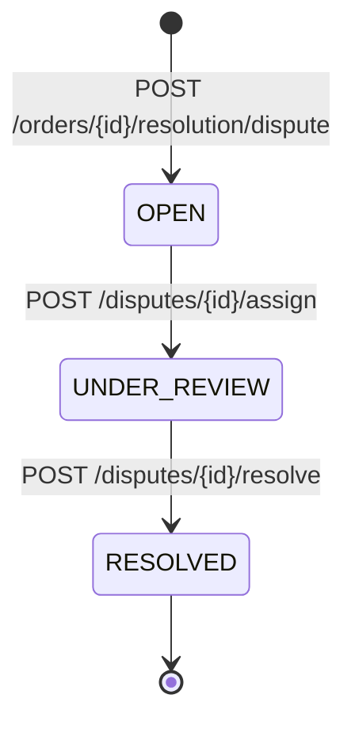

`sdk.disputes` handles disagreement workflows between buyers and sellers. Disputes freeze an order's financial operations until they are resolved, and the resolution decision controls where the escrowed funds go.

## Dispute fields

A `Dispute` object contains:

| Field | Type | Notes |
|-------|------|-------|
| `id` | `string` | `dsp_`-prefixed dispute ID |
| `orderId` | `string` | The disputed order |
| `openedBy` | `'BUYER' \| 'SELLER'` | Who opened the dispute |
| `reason` | `'NOT_DELIVERED' \| 'QUALITY_ISSUE' \| 'OTHER'` | Categorized reason |
| `evidence` | `string[]?` | Optional evidence references |
| `status` | `'OPEN' \| 'UNDER_REVIEW' \| 'RESOLVED'` | Dispute lifecycle |
| `resolutionDecision` | `'FULL_RELEASE' \| 'FULL_REFUND' \| 'SPLIT' \| null` | Set when resolved |
| `decisionNote` | `string \| null` | Resolution note |
| `createdAt` / `updatedAt` | `string` | ISO timestamps |

## Dispute lifecycle



Dispute states in the SDK type surface are `OPEN`, `UNDER_REVIEW`, and `RESOLVED`. The dispute status is independent of the order status — opening a dispute moves the **order** to `DISPUTED` and blocks release/refund until the dispute is resolved.

## Open a dispute

`sdk.disputes.open(orderId, data)` → `POST /orders/{orderId}/resolution/dispute`

Creates a dispute and moves the order to `DISPUTED`.

| Field | Type | Required | Notes |
|-------|------|----------|-------|
| `openedBy` | `'BUYER' \| 'SELLER'` | Yes | Who is disputing |
| `reason` | `'NOT_DELIVERED' \| 'QUALITY_ISSUE' \| 'OTHER'` | Yes | Categorized reason |
| `evidence` | `string[]` | No | Evidence references (URLs, IDs) |

Preconditions:

- Order must be in `IN_PROGRESS`
- Order must not already have an active dispute
- Order must have an escrow (implied by being past `IN_PROGRESS`)

```typescript
const dispute = await sdk.disputes.open('ord_abc123', {
  openedBy: 'BUYER',
  reason: 'NOT_DELIVERED',
  evidence: ['https://example.com/evidence/1']
});
```

Possible errors:

- `400` — order not in `IN_PROGRESS` (`INVALID_STATE`)
- `404` — order not found (`ORDER_NOT_FOUND`)
- `409` — an active dispute already exists on the order (`DISPUTE_ALREADY_OPEN`)

## List disputes

`sdk.disputes.list(params?)` → `GET /disputes`

Returns a flat list of disputes. Unlike orders, this endpoint is not paginated.

| Param | Type | Notes |
|-------|------|-------|
| `orderId` | `string` | Only disputes for this order |
| `status` | `'OPEN' \| 'UNDER_REVIEW' \| 'RESOLVED'` | Filter by status |
| `openedBy` | `'BUYER' \| 'SELLER'` | Filter by opener |

```typescript
const open = await sdk.disputes.list({ status: 'OPEN', openedBy: 'BUYER' });
const forOrder = await sdk.disputes.list({ orderId: 'ord_abc123' });
```

Possible errors:

- Filter values are passed through to the database without server-side validation — use the documented enum values (`status`, `openedBy`), as unknown values will simply match nothing or fail the query

## Get a dispute

`sdk.disputes.get(disputeId)` → `GET /disputes/{disputeId}`

Returns the dispute with its `order` relation included.

```typescript
const dispute = await sdk.disputes.get('dsp_abc123');
console.log(dispute.status, dispute.order?.status);
```

Possible errors:

- `404` — dispute not found (`DISPUTE_NOT_FOUND`)

## Assign a dispute

`sdk.disputes.assign(disputeId, data)` → `POST /disputes/{disputeId}/assign`

Assigns the dispute to a support agent and moves it to `UNDER_REVIEW`.

| Field | Type | Required | Notes |
|-------|------|----------|-------|
| `assignedTo` | `string` | Yes | Agent user ID or name |

Preconditions:

- Dispute must be in `OPEN`

```typescript
await sdk.disputes.assign('dsp_abc123', { assignedTo: 'agent_support01' });
```

Possible errors:

- `400` — dispute is not in `OPEN` (`INVALID_STATE`)
- `404` — dispute not found (`DISPUTE_NOT_FOUND`)

## Resolve a dispute

`sdk.disputes.resolve(disputeId, data)` → `POST /disputes/{disputeId}/resolve`

Closes the dispute with a financial decision.

| Field | Type | Required | Notes |
|-------|------|----------|-------|
| `decision` | `'FULL_RELEASE' \| 'FULL_REFUND' \| 'SPLIT'` | Yes | Resolution outcome |
| `releaseAmount` | `string` | Only for `SPLIT` | Decimal string, exactly 2 decimals |
| `refundAmount` | `string` | Only for `SPLIT` | Decimal string, exactly 2 decimals |
| `note` | `string` | No | Free-form resolution note |

Preconditions:

- Dispute must be in `UNDER_REVIEW`
- For `SPLIT`: both `releaseAmount` and `refundAmount` are required and must sum **exactly** to the order amount

```typescript
// Full release to seller
await sdk.disputes.resolve('dsp_abc123', {
  decision: 'FULL_RELEASE',
  note: 'Evidence shows work was completed'
});

// Full refund to buyer
await sdk.disputes.resolve('dsp_abc123', {
  decision: 'FULL_REFUND',
  note: 'Work was not delivered'
});

// Split decision
await sdk.disputes.resolve('dsp_abc123', {
  decision: 'SPLIT',
  releaseAmount: '60.00',
  refundAmount: '40.00',
  note: 'Partial work completed'
});
```

<Callout type="warning">
  The SPLIT amounts are validated against the **order** amount. If `releaseAmount + refundAmount` does not equal the order total, the Orchestrator rejects the resolution.
</Callout>

On resolution the underlying order is settled and closed: `FULL_RELEASE` runs the escrow release flow, `FULL_REFUND` runs the escrow refund flow, and `SPLIT` distributes the escrow to both parties through a single dispute resolution transaction and credits both balances.

Possible errors:

- `400` — dispute not in `UNDER_REVIEW` (`INVALID_STATE`)
- `404` — dispute not found (`DISPUTE_NOT_FOUND`)
- `422` — missing SPLIT amounts or amounts that do not sum to the order amount (`INVALID_AMOUNT`)

## Error handling

All methods throw typed SDK errors. The most relevant for disputes:

| Error class | HTTP | When |
|-------------|------|------|
| `ValidationError` | 400 | DTO validation failed (bad `reason`, missing `assignedTo`, bad amount format) |
| `NotFoundError` | 404 | Order or dispute does not exist |
| `InvalidTransitionError` | 409 | Dispute/order in a state that does not allow the operation |

```typescript
import { InvalidTransitionError, NotFoundError } from '@offerhub/sdk';

try {
  await sdk.disputes.resolve('dsp_abc123', { decision: 'FULL_RELEASE' });
} catch (error) {
  if (error instanceof InvalidTransitionError) {
    console.error('Dispute is not under review:', error.currentState);
  } else if (error instanceof NotFoundError) {
    console.error('Dispute does not exist');
  }
}
```

## Sources

All behavior on this page was verified against the orchestrator repository (`OFFER-HUB/OFFER-HUB`), not inferred:

- SDK client: `packages/sdk/src/resources/disputes.ts`
- Controllers: `apps/api/src/modules/disputes/disputes.controller.ts`, `apps/api/src/modules/resolution/resolution.controller.ts`
- Service: `apps/api/src/modules/resolution/resolution.service.ts`
- DTOs: `apps/api/src/modules/resolution/dto/open-dispute.dto.ts`, `apps/api/src/modules/resolution/dto/assign-dispute.dto.ts`, `apps/api/src/modules/resolution/dto/resolve-dispute.dto.ts`
- State machine: `packages/shared/src/enums/dispute-status.enum.ts`

## Related pages

- [Disputes Guide](/docs/guide/disputes) — dispute workflow concepts
- [Orders SDK Reference](/docs/sdk/orders) — `sdk.orders` method reference
- [Withdrawals SDK Reference](/docs/sdk/withdrawals) — `sdk.withdrawals` method reference
- [Events Reference](/docs/api-reference/events) — `DISPUTE_OPENED`, `DISPUTE_UNDER_REVIEW`, `DISPUTE_RESOLVED` event payloads