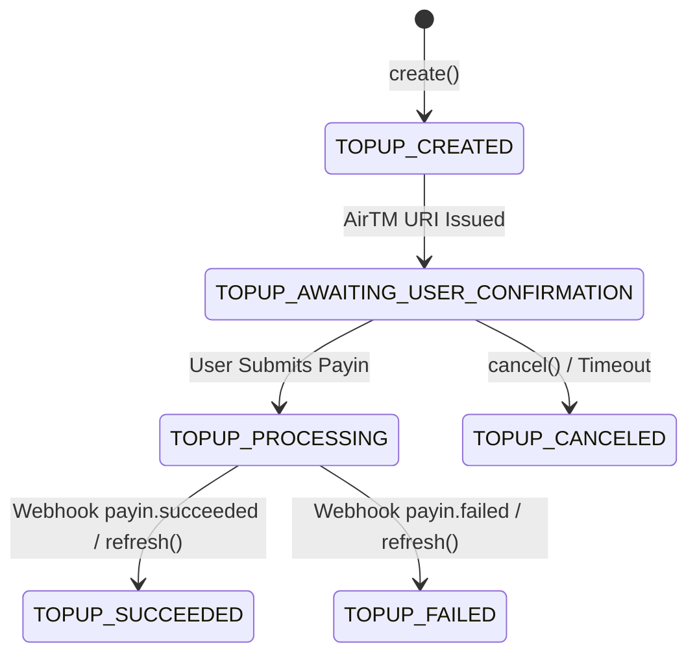

The `sdk.topups` resource manages fiat-to-balance deposits when OFFER-HUB is configured with `PAYMENT_PROVIDER=airtm`. AirTM top-ups allow users to fund their balances using 200+ local payment methods (bank transfers, mobile money, cash points). The top-up flow is asynchronous: the SDK generates a checkout URL, the user confirms payment in AirTM, and the Orchestrator receives an inbound webhook to credit the user's balance.

<Callout type="note">
  **Orchestrator Source References:**
  - Controller: `apps/api/src/modules/topups/topups.controller.ts`
  - DTOs:
    - `CreateTopupDto` (`apps/api/src/modules/topups/dto/create-topup.dto.ts`)
    - `ListTopupsDto` (`apps/api/src/modules/topups/dto/list-topups.dto.ts`)
  - Service: `apps/api/src/modules/topups/topups.service.ts`
  - Database Model: `Topup` in `packages/db/prisma/schema.prisma`
</Callout>

---

## Top-up State Machine



| State | Description |
|---|---|
| `TOPUP_CREATED` | Top-up request initiated |
| `TOPUP_AWAITING_USER_CONFIRMATION` | Waiting for user to complete checkout via confirmation URI |
| `TOPUP_PROCESSING` | Payment submitted, AirTM network verifying settlement |
| `TOPUP_SUCCEEDED` | Payment confirmed by AirTM; user balance credited |
| `TOPUP_FAILED` | Payment rejected or abandoned by user |
| `TOPUP_CANCELED` | Top-up cancelled by user or platform before payment completion |

---

## Resource Overview
### Top-up Callback Sequence

`mermaid
sequenceDiagram
    accTitle: AirTM top-up with inbound callback
    accDescr: User starts top-up, redirects to AirTM, completes payment, AirTM posts inbound webhook to Orchestrator, which credits balance and emits topup.succeeded over SSE.
    autonumber
    participant App
    participant Orchestrator
    participant AirTM
    participant User
    App->>Orchestrator: POST /api/v1/topups
    Orchestrator->>AirTM: create payin
    AirTM-->>Orchestrator: confirmationUri
    Orchestrator-->>App: 201 TOPUP_AWAITING_USER_CONFIRMATION
    App->>User: redirect to confirmationUri
    User->>AirTM: complete payment
    AirTM-->>Orchestrator: POST /webhooks/airtm (Svix)
    Orchestrator->>Orchestrator: verify + credit balance
    Orchestrator-->>App: SSE topup.succeeded
`


| Method | HTTP Route | Description |
|---|---|---|
| [`sdk.topups.create()`](#create) | `POST /api/v1/topups` | Creates a new AirTM top-up payin request |
| [`sdk.topups.list()`](#list) | `GET /api/v1/topups` | Lists paginated top-up records with filtering |
| [`sdk.topups.get()`](#get) | `GET /api/v1/topups/:id` | Retrieves single top-up status and metadata |
| [`sdk.topups.refresh()`](#refresh) | `POST /api/v1/topups/:id/refresh` | Synchronously queries AirTM API to refresh status |
| [`sdk.topups.cancel()`](#cancel) | `POST /api/v1/topups/:id/cancel` | Cancels a pending unconfirmed top-up |

---

## Common Types

```typescript
type TopupStatus =
  | 'TOPUP_CREATED'
  | 'TOPUP_AWAITING_USER_CONFIRMATION'
  | 'TOPUP_PROCESSING'
  | 'TOPUP_SUCCEEDED'
  | 'TOPUP_FAILED'
  | 'TOPUP_CANCELED';

interface Topup {
  id: string; // e.g. "top_01HXYZ789"
  userId: string; // e.g. "usr_abc123"
  amount: string; // e.g. "100.00"
  currency: string; // e.g. "USD"
  status: TopupStatus;
  airtm?: {
    confirmationUri?: string; // Redirect URI for buyer checkout
    paymentUrl?: string; // Web URL alias
    airtmPayinId?: string; // AirTM internal payin ID
    expiresAt?: string; // ISO-8601 expiration timestamp
  };
  createdAt: string; // ISO-8601 string
  updatedAt: string; // ISO-8601 string
}
```

---

## Methods

### `create`

Initiates an AirTM top-up payin request. Returns the top-up entity along with the AirTM `confirmationUri` to which the user must be redirected.

#### Signature

```typescript
async create(params: CreateTopupParams): Promise<Topup>
```

#### Parameters

`params: CreateTopupParams`

| Parameter | Type | Required | Description |
|---|---|---|---|
| `userId` | `string` | **Yes** | Target OFFER-HUB user ID (must have a linked AirTM account) |
| `amount` | `string` | **Yes** | Amount to deposit (minimum `$5.00 USD`) |
| `currency` | `string` | **Yes** | Currency code (e.g. `'USD'`) |

#### Return Type

`Promise<Topup>`

#### Errors

| Error Class | HTTP Status | Code | Cause |
|---|---|---|---|
| `ValidationError` | `400` | `AMOUNT_BELOW_MINIMUM` | Requested amount is below the AirTM minimum threshold ($5.00) |
| `ValidationError` | `422` | `AIRTM_USER_NOT_LINKED` | User has not linked an AirTM account via `sdk.users.linkAirtm()` |
| `NotFoundError` | `404` | `USER_NOT_FOUND` | Specified `userId` does not exist |
| `OfferHubError` | `503` | `AIRTM_UNAVAILABLE` | AirTM Enterprise API endpoint unreachable or returned an error |

#### Example

```typescript
import { OfferHubSDK, ValidationError } from '@offerhub/sdk';

const sdk = new OfferHubSDK({
  apiUrl: process.env.OFFERHUB_API_URL!,
  apiKey: process.env.OFFERHUB_API_KEY!,
});

async function startDeposit(userId: string, amount: string) {
  try {
    const topup = await sdk.topups.create({
      userId,
      amount,
      currency: 'USD',
    });

    console.log('Top-up created:', topup.id);
    console.log('Status:', topup.status);

    // Redirect the user to complete payment on AirTM
    if (topup.airtm?.confirmationUri) {
      window.location.href = topup.airtm.confirmationUri;
    }

    return topup;
  } catch (error) {
    if (error instanceof ValidationError) {
      console.error('Validation error:', error.details);
    } else {
      console.error('Failed to initiate top-up:', error);
    }
  }
}
```

---

### `list`

Retrieves a paginated list of top-ups, with optional filtering by user ID and status.

#### Signature

```typescript
async list(params?: ListTopupsParams): Promise<PaginatedTopups>
```

#### Parameters

`params?: ListTopupsParams`

| Parameter | Type | Required | Description |
|---|---|---|---|
| `userId` | `string` | No | Filter by specific user ID |
| `status` | `TopupStatus` | No | Filter by top-up lifecycle status |
| `limit` | `number` | No | Results per page (default: `20`, max: `100`) |
| `cursor` | `string` | No | Pagination cursor |

#### Return Type

```typescript
interface PaginatedTopups {
  items: Topup[];
  pagination: {
    hasMore: boolean;
    nextCursor?: string | null;
    total?: number;
  };
}
```

#### Errors

| Error Class | HTTP Status | Code | Cause |
|---|---|---|---|
| `ValidationError` | `400` | `INVALID_FILTER` | Malformed pagination parameter or invalid status enum value |

#### Example

```typescript
const pendingTopups = await sdk.topups.list({
  userId: 'usr_abc123',
  status: 'TOPUP_AWAITING_USER_CONFIRMATION',
  limit: 10,
});

console.log(`Found ${pendingTopups.items.length} pending top-ups.`);
for (const item of pendingTopups.items) {
  console.log(`- ${item.id}: $${item.amount} ${item.currency}`);
}
```

---

### `get`

Fetches a single top-up record by its unique identifier.

#### Signature

```typescript
async get(id: string): Promise<Topup>
```

#### Parameters

| Parameter | Type | Required | Description |
|---|---|---|---|
| `id` | `string` | **Yes** | Top-up unique identifier (`top_...`) |

#### Return Type

`Promise<Topup>`

#### Errors

| Error Class | HTTP Status | Code | Cause |
|---|---|---|---|
| `NotFoundError` | `404` | `TOPUP_NOT_FOUND` | Top-up ID does not exist |

#### Example

```typescript
const topup = await sdk.topups.get('top_xyz789');

if (topup.status === 'TOPUP_SUCCEEDED') {
  console.log('Top-up has completed successfully.');
} else {
  console.log(`Current top-up status: ${topup.status}`);
}
```

---

### `refresh`

Queries the upstream AirTM API directly to check payin status. If AirTM confirms the payment or reports a failure, the local database state is updated immediately and `topup.succeeded` or `topup.failed` events are emitted.

#### Signature

```typescript
async refresh(id: string): Promise<Topup>
```

#### Parameters

| Parameter | Type | Required | Description |
|---|---|---|---|
| `id` | `string` | **Yes** | Top-up identifier |

#### Return Type

`Promise<Topup>`

#### Errors

| Error Class | HTTP Status | Code | Cause |
|---|---|---|---|
| `NotFoundError` | `404` | `TOPUP_NOT_FOUND` | Top-up ID does not exist |
| `ProviderTimeoutError` | `504` | `PROVIDER_TIMEOUT` | External AirTM API request timed out |

#### Example

```typescript
const refreshed = await sdk.topups.refresh('top_xyz789');
console.log('Synchronized top-up status:', refreshed.status);
```

---

### `cancel`

Cancels an active top-up that is in `TOPUP_CREATED` or `TOPUP_AWAITING_USER_CONFIRMATION` status.

#### Signature

```typescript
async cancel(id: string): Promise<Topup>
```

#### Parameters

| Parameter | Type | Required | Description |
|---|---|---|---|
| `id` | `string` | **Yes** | Top-up identifier to cancel |

#### Return Type

`Promise<Topup>` (with `status: 'TOPUP_CANCELED'`)

#### Errors

| Error Class | HTTP Status | Code | Cause |
|---|---|---|---|
| `NotFoundError` | `404` | `TOPUP_NOT_FOUND` | Top-up not found |
| `InvalidTransitionError` | `409` | `CANNOT_CANCEL_TOPUP` | Top-up is already in `TOPUP_PROCESSING` or `TOPUP_SUCCEEDED` status |

#### Example

```typescript
import { OfferHubSDK, InvalidTransitionError } from '@offerhub/sdk';

try {
  const canceledTopup = await sdk.topups.cancel('top_xyz789');
  console.log(`Top-up ${canceledTopup.id} has been canceled.`);
} catch (error) {
  if (error instanceof InvalidTransitionError) {
    console.error('Cannot cancel: payment is already being processed or completed.');
  }
}
```

---

## Related Resources

- [Users Reference (`sdk.users`)](/docs/sdk/users) — Linking AirTM accounts (`linkAirtm`)
- [Balance Reference (`sdk.balance`)](/docs/sdk/balance) — Checking credited balances
- [Deposits Guide](/docs/guide/deposits) — High-level deposit flow and webhooks
- [Real-Time Events & Webhooks](/docs/api-reference/webhooks) — Listening for `topup.succeeded` events
