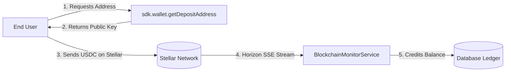

The `sdk.wallet` resource provides access to OFFER-HUB's invisible custodial wallet infrastructure. When running in crypto mode (`PAYMENT_PROVIDER=crypto`), every registered user has an automatically provisioned Stellar keypair with AES-256-GCM encrypted private keys. This resource allows integrators to fetch wallet status, permanent deposit addresses, and on-chain transaction history.

<Callout type="note">
  **Orchestrator Source References:**
  - Controller: `apps/api/src/modules/wallet/wallet.controller.ts`
  - DTOs:
    - `DepositAddressDto` (`apps/api/src/modules/wallet/dto/deposit-address.dto.ts`)
    - `WalletTransactionsQueryDto` (`apps/api/src/modules/wallet/dto/wallet-transactions-query.dto.ts`)
  - Service: `apps/api/src/modules/wallet/wallet.service.ts`
  - Database Models: `Wallet`, `StellarTransaction` in `packages/db/prisma/schema.prisma`
</Callout>

---

## Invisible Wallet Model



---

## Resource Overview

| Method | HTTP Route | Description |
|---|---|---|
| [`sdk.wallet.getInfo()`](#getinfo) | `GET /api/v1/users/:userId/wallet` | Retrieves wallet metadata, public key, and status |
| [`sdk.wallet.getDepositAddress()`](#getdepositaddress) | `GET /api/v1/users/:userId/wallet/deposit` | Retrieves permanent deposit address and asset details |
| [`sdk.wallet.getTransactions()`](#gettransactions) | `GET /api/v1/users/:userId/wallet/transactions` | Lists paginated on-chain Stellar transactions |

---

## Methods

### `getInfo`

Retrieves metadata and status for a user's invisible Stellar wallet.

#### Signature

```typescript
async getInfo(userId: string): Promise<WalletInfo>
```

#### Parameters

| Parameter | Type | Required | Description |
|---|---|---|---|
| `userId` | `string` | **Yes** | Target OFFER-HUB user ID (`usr_...`) |

#### Return Type

```typescript
interface WalletInfo {
  userId: string;
  publicKey: string; // Stellar public key starting with 'G...'
  network: 'testnet' | 'mainnet';
  provider: 'crypto' | 'airtm';
  status: 'ACTIVE' | 'INACTIVE';
  createdAt: string; // ISO-8601 string
}
```

#### Errors

| Error Class | HTTP Status | Code | Cause |
|---|---|---|---|
| `NotFoundError` | `404` | `WALLET_NOT_FOUND` | User or wallet does not exist, or running in AirTM-only mode |
| `OfferHubError` | `500` | `INTERNAL_ERROR` | Server failure querying wallet record |

#### Example

```typescript
import { OfferHubSDK } from '@offerhub/sdk';

const sdk = new OfferHubSDK({
  apiUrl: process.env.OFFERHUB_API_URL!,
  apiKey: process.env.OFFERHUB_API_KEY!,
});

const walletInfo = await sdk.wallet.getInfo('usr_abc123');
console.log('Stellar Public Key:', walletInfo.publicKey);
console.log('Network:', walletInfo.network);
console.log('Status:', walletInfo.status);
```

---

### `getDepositAddress`

Retrieves the permanent deposit address where the user can send funds. In crypto mode, this is their Stellar public key with USDC asset specifications. The address is static and safe to cache or display directly in checkout views.

#### Signature

```typescript
async getDepositAddress(userId: string): Promise<DepositAddress>
```

#### Parameters

| Parameter | Type | Required | Description |
|---|---|---|---|
| `userId` | `string` | **Yes** | Target OFFER-HUB user ID |

#### Return Type

```typescript
interface DepositAddress {
  provider: 'crypto' | 'airtm';
  method: 'stellar_address' | 'airtm_payin';
  address: string; // Stellar G... public key or payment identifier
  asset: {
    code: string; // "USDC"
    issuer: string; // Stellar issuer public key (Circle)
  };
  network: 'testnet' | 'mainnet';
  memo?: string | null;
  instructions: string;
}
```

#### Errors

| Error Class | HTTP Status | Code | Cause |
|---|---|---|---|
| `NotFoundError` | `404` | `USER_NOT_FOUND` | User not found |
| `NotFoundError` | `404` | `WALLET_NOT_FOUND` | No wallet initialized for this user |

#### Example

```typescript
const deposit = await sdk.wallet.getDepositAddress('usr_abc123');

console.log(`Deposit ${deposit.asset.code} to: ${deposit.address}`);
console.log(`Issuer: ${deposit.asset.issuer}`);
console.log(`Network: ${deposit.network}`);
console.log(`Instructions: ${deposit.instructions}`);
```

---

### `getTransactions`

Retrieves a paginated list of on-chain Stellar transactions recorded for the user's wallet address.

#### Signature

```typescript
async getTransactions(
  userId: string,
  params?: WalletTransactionsParams
): Promise<PaginatedWalletTransactions>
```

#### Parameters

| Parameter | Type | Required | Description |
|---|---|---|---|
| `userId` | `string` | **Yes** | Target OFFER-HUB user ID |
| `params.limit` | `number` | No | Number of transactions per page (default: `20`, max: `100`) |
| `params.cursor` | `string` | No | Cursor identifier for pagination |
| `params.order` | `'asc' \| 'desc'` | No | Sorting order by creation time (default: `'desc'`) |

#### Return Type

```typescript
interface WalletTransaction {
  id: string; // Internal transaction ID e.g. "tx_01HXYZ..."
  hash: string; // Stellar on-chain transaction hash
  type: 'DEPOSIT' | 'WITHDRAWAL' | 'ESCROW_LOCK' | 'ESCROW_RELEASE';
  amount: string; // Decimal string e.g. "100.00"
  asset: string; // "USDC"
  from: string; // Source Stellar address
  to: string; // Destination Stellar address
  status: 'SUCCESS' | 'PENDING' | 'FAILED';
  createdAt: string; // ISO-8601 timestamp
}

interface PaginatedWalletTransactions {
  items: WalletTransaction[];
  pagination: {
    hasMore: boolean;
    nextCursor?: string | null;
    total?: number;
  };
}
```

#### Errors

| Error Class | HTTP Status | Code | Cause |
|---|---|---|---|
| `NotFoundError` | `404` | `WALLET_NOT_FOUND` | Wallet not found |
| `ValidationError` | `400` | `INVALID_PAGINATION` | Invalid limit or cursor parameter |

#### Example

```typescript
const history = await sdk.wallet.getTransactions('usr_abc123', {
  limit: 10,
  order: 'desc',
});

console.log(`Retrieved ${history.items.length} transactions:`);
for (const tx of history.items) {
  console.log(`- [${tx.type}] ${tx.amount} ${tx.asset} (Hash: ${tx.hash}) - ${tx.status}`);
}

if (history.pagination.hasMore && history.pagination.nextCursor) {
  console.log('Next cursor:', history.pagination.nextCursor);
}
```

---

## Related Resources

- [Users Reference (`sdk.users`)](/docs/sdk/users) — User creation and identity management
- [Balance Reference (`sdk.balance`)](/docs/sdk/balance) — Balance ledger and reconciliation
- [Wallets Guide](/docs/guide/wallets) — Architectural overview of invisible wallets
- [Deposits Guide](/docs/guide/deposits) — On-chain deposits and Horizon streaming
