# Test Report: Change Password & Delete Account

**Issue Number**: #[1346]
**Date**: [May 31, 2026]
**Tester**: [Okorie chigozie]

## Profile Setup

### Real Profile Data

- **Email**: [Your Real Email]
- **Username**: [Your Real Username]
- **First Name**: [Your Real First Name]
- **Last Name**: [Your Real Last Name]
- **Bio**: [Your Professional Bio]
- **Location**: [Your Location]
- **Timezone**: [Your Timezone]
- **Profile Photo**: ✓ [Attached - Screenshot 1]

### Screenshot: Completed Profile

## 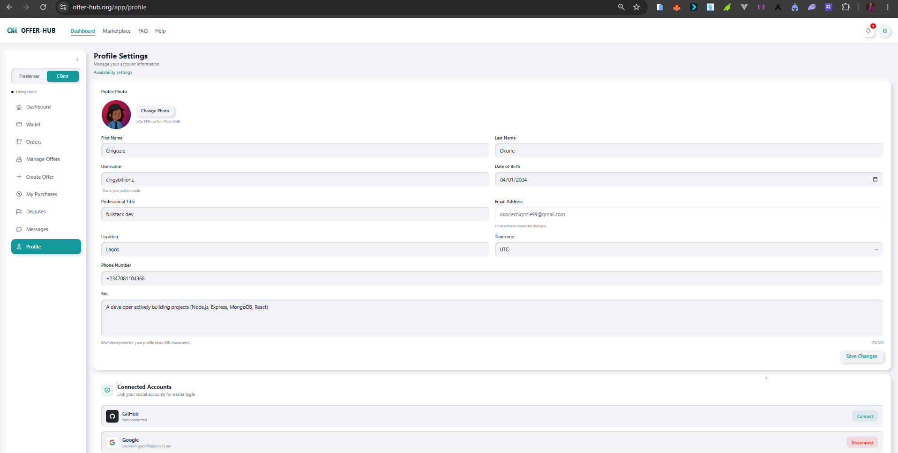

## Service Listing

### Published Service

- **Title**: [Service Title]
- **Description**: [Service Description]
- **Price**: [Real Price]
- **Delivery Time**: [Real Timeline]
- **Service Image**: ✓ [Attached - Real Image]

### Screenshot: Published Service

## 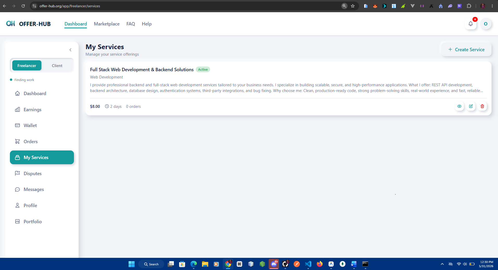

## Offer Listing

### Published Offer

- **Title**: [Offer Title]
- **Description**: [Offer Description]
- **Budget**: [Real Budget]
- **Timeline**: [Real Timeline]

### Screenshot: Published Offer

---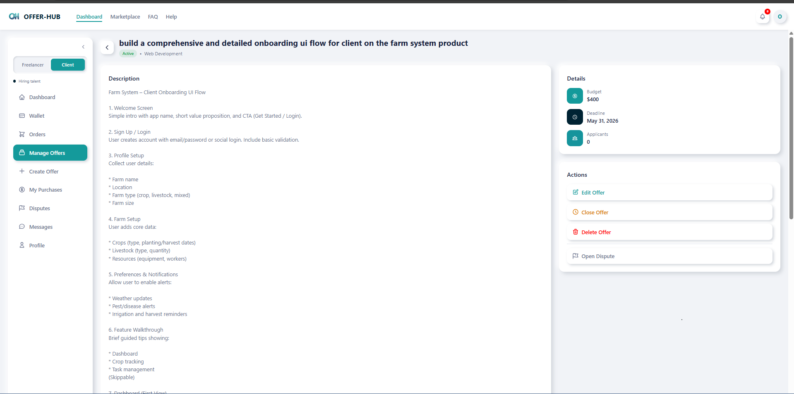

## Test Case 1: Change Password

### Setup

- Logged in with test account
- Navigated to Account Settings > Security section

### Steps

1. Entered current password
2. Entered new password (min. 8 characters)
3. Confirmed new password
4. Clicked "Change Password" button

### Expected Results

- ✓ Form accepts matching new passwords
- ✓ Form rejects mismatched passwords
- ✓ Form rejects current password when incorrect
- ✓ Password successfully changed
- ✓ User can log in with new password
- ✓ User cannot log in with old password

### Results

**PASS** / **FAIL** - [Explanation if failed]
failed: While testing the **Change Password** feature, I entered my current password, a valid new password, and confirmed the new password correctly. All required fields were filled, and the password met the strength requirements.

However, after submitting, the system returned an error stating:
**“currentPassword, newPassword, and confirmPassword are required”**.

This indicates a possible issue where the form inputs are not being properly captured or sent to the backend, despite being filled on the UI.

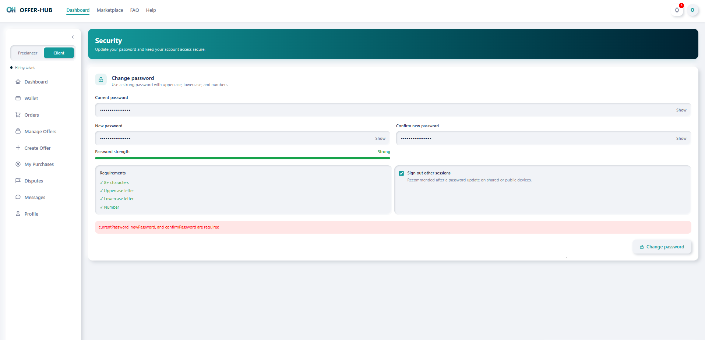

### Screenshot: Settings Page

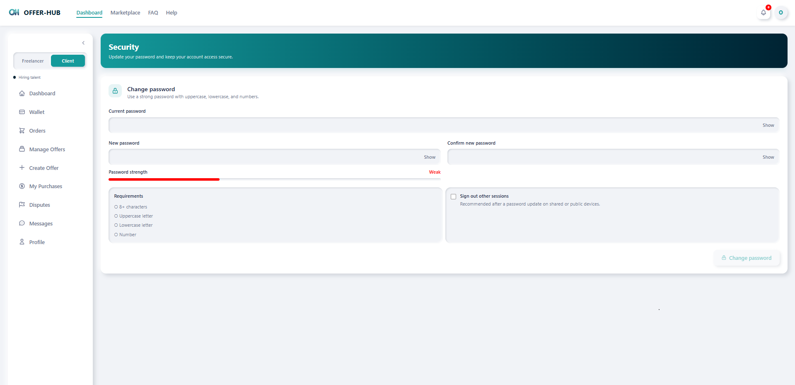

### Screenshot: Successful Change

failed: i did not receieve a success message

### Screenshot: Login with New Password

rememeber i dint not received a success!!

---

## Test Case 2: Delete Account

### Setup

- Logged in with test account
- Navigated to Account Settings > Delete Account section

### Steps

1. Clicked "Continue with Deletion" button
2. Entered password to confirm identity
3. Typed "DELETE MY ACCOUNT" in confirmation field
4. Clicked "Delete Account" button
5. Attempted to log in with old credentials

### Expected Results

- ✓ Delete account option is visible and accessible
- ✓ Confirmation dialog appears with warning
- ✓ Form requires correct password
- ✓ Form requires exact confirmation text
- ✓ Delete button is disabled until confirmation text matches
- ✓ Account is deleted successfully
- ✓ User is logged out after deletion
- ✓ User cannot log in with deleted account credentials
- ✓ Data is removed from the system

### Results

**PASS** / **FAIL** - [Explanation if failed]

### Screenshot: Delete Account Section

[Paste screenshot showing delete account option]
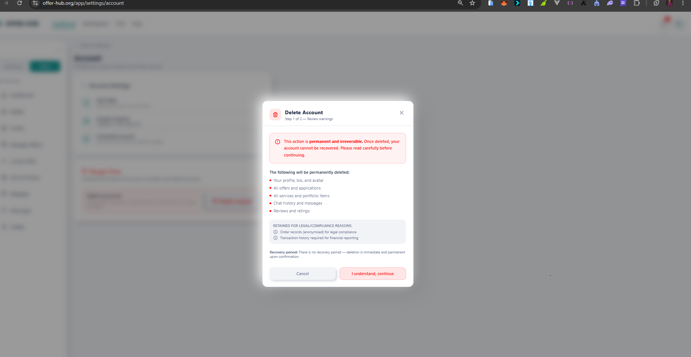

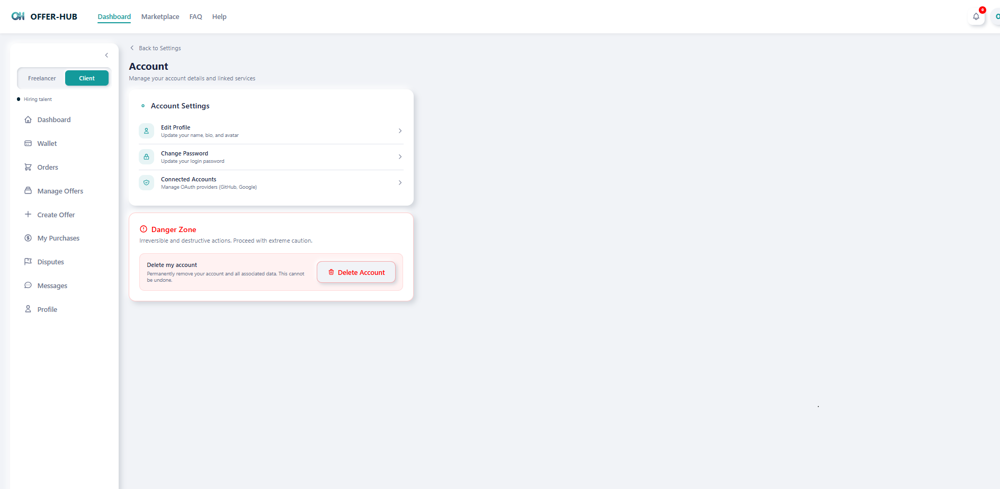

### Screenshot: Confirmation Dialog

[Paste screenshot showing confirmation dialog]
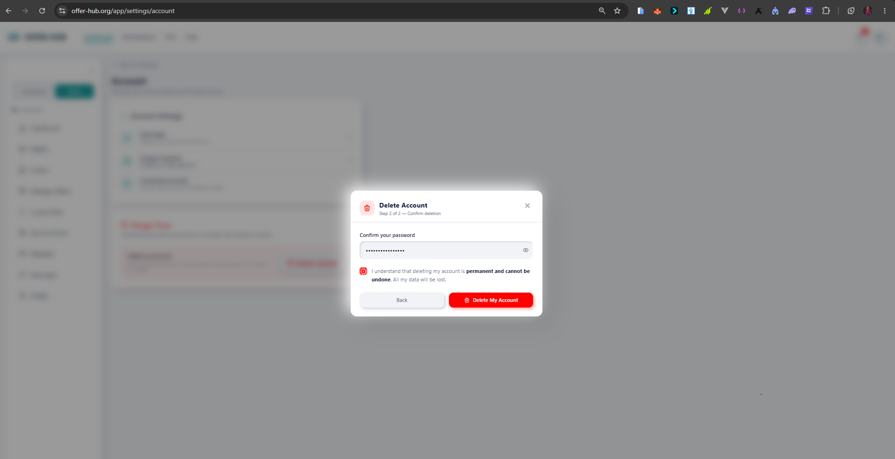

### Screenshot: Successful Deletion

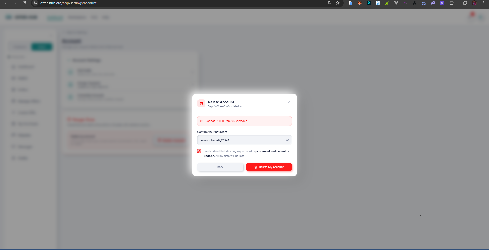 failed: delete account failed i was not able to delete accoungt and this is the error it showed
[Paste screenshot showing success message]

### Screenshot: Login Failed

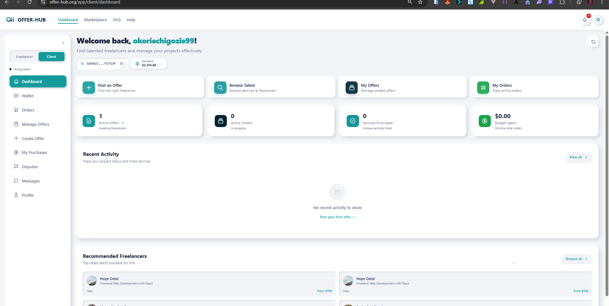 success: i was still able to sign in with my credentials

[Paste screenshot showing login failed message after account deletion]

---

## Error Scenarios

### Test: Wrong Current Password

- **Input**: Correct username, incorrect current password, valid new password
- **Expected**: Error message "Current password is incorrect"
- **Result**: ✓ PASS / ✗ FAIL
- **Screenshot**: [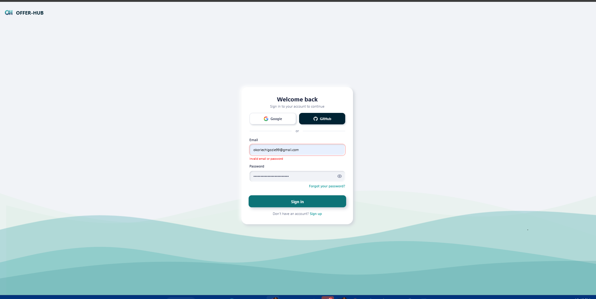]

### Test: Mismatched New Passwords

- **Input**: Valid current password, non-matching new passwords
- **Expected**: Error message "New passwords do not match"
- **Result**: ✓ PASS / ✗ FAIL
- **Screenshot**: [Paste here]

### Test: Password Too Short

- **Input**: Valid current password, new password with less than 8 characters
- **Expected**: Error message "Password must be at least 8 characters"
- **Result**: ✓ PASS / ✗ FAIL
- **Screenshot**: [] note: password too short is same as invalid passowrd

### Test: Delete Account - Wrong Password

- **Input**: Incorrect password, correct confirmation text
- **Expected**: Error message "Incorrect password. Account deletion cancelled"
- **Result**: ✓ PASS / ✗ FAIL
- **Screenshot**: [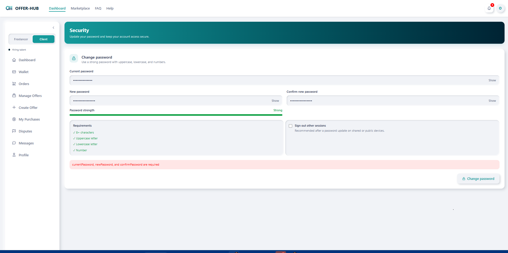] note: it is still showing our former error

### Test: Delete Account - Wrong Confirmation

- **Input**: Correct password, incorrect confirmation text
- **Expected**: Error message "Please confirm by typing 'DELETE MY ACCOUNT'"
- **Result**: ✓ PASS / ✗ FAIL
- **Screenshot**: [] note still on the error message

---

## Summary

| Feature                     | Status          |
| --------------------------- | --------------- | --- |
| Change Password Form        | ✓ PASS / ✗ FAIL | ✗   |
| Change Password Validation  | ✓ PASS / ✗ FAIL | ✗   |
| Delete Account Form         | ✓ PASS / ✗ FAIL | ✗   |
| Delete Account Confirmation | ✓ PASS / ✗ FAIL | ✗   |
| Session Management          | ✓ PASS / ✗ FAIL | ✗   |
| Error Handling              | ✓ PASS / ✗ FAIL | ✗   |

### Overall Result

**✓ ALL TESTS PASSED** / **✗ SOME TESTS FAILED**
My test: ✗ some tests failed

### Notes

[Add any additional observations or edge cases discovered]

---

## Sign-off

- **Tester**: [okorie chigozie]
- **Date**: [May 31, 2026]
- **Environment**: Production (https://www.offer-hub.org)
- **Browser**: [Chrome]
- **OS**: [Windows]
